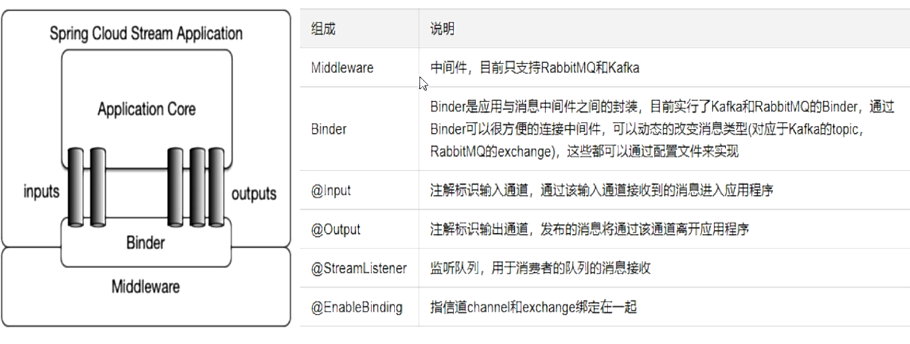

- [SpringCloud总结](#springcloud%E6%80%BB%E7%BB%93)
  - [1 项目模块的创建](#1-%E9%A1%B9%E7%9B%AE%E6%A8%A1%E5%9D%97%E7%9A%84%E5%88%9B%E5%BB%BA)
  - [2 RestTemplate](#2-resttemplate)
  - [3 Hutool工具包](#3-hutool%E5%B7%A5%E5%85%B7%E5%8C%85)
  - [4 Eureka服务注册与发现](#4-eureka%E6%9C%8D%E5%8A%A1%E6%B3%A8%E5%86%8C%E4%B8%8E%E5%8F%91%E7%8E%B0)
    - [4.1 服务注册与发现](#41-%E6%9C%8D%E5%8A%A1%E6%B3%A8%E5%86%8C%E4%B8%8E%E5%8F%91%E7%8E%B0)
    - [4.2 自我保护](#42-%E8%87%AA%E6%88%91%E4%BF%9D%E6%8A%A4)
    - [4.3 Eureka停更](#43-eureka%E5%81%9C%E6%9B%B4)
  - [5 Zookeeper服务注册与发现](#5-zookeeper%E6%9C%8D%E5%8A%A1%E6%B3%A8%E5%86%8C%E4%B8%8E%E5%8F%91%E7%8E%B0)
  - [6 Consul服务注册与发现](#6-consul%E6%9C%8D%E5%8A%A1%E6%B3%A8%E5%86%8C%E4%B8%8E%E5%8F%91%E7%8E%B0)
  - [7 三个注册中心的异同点](#7-%E4%B8%89%E4%B8%AA%E6%B3%A8%E5%86%8C%E4%B8%AD%E5%BF%83%E7%9A%84%E5%BC%82%E5%90%8C%E7%82%B9)
  - [8 Ribbon负载均衡服务调用](#8-ribbon%E8%B4%9F%E8%BD%BD%E5%9D%87%E8%A1%A1%E6%9C%8D%E5%8A%A1%E8%B0%83%E7%94%A8)
    - [8.1 RestTemplate的使用](#81-resttemplate%E7%9A%84%E4%BD%BF%E7%94%A8)
    - [8.2 IRule负载均衡规则](#82-irule%E8%B4%9F%E8%BD%BD%E5%9D%87%E8%A1%A1%E8%A7%84%E5%88%99)
    - [8.3 自定义负载均衡算法](#83-%E8%87%AA%E5%AE%9A%E4%B9%89%E8%B4%9F%E8%BD%BD%E5%9D%87%E8%A1%A1%E7%AE%97%E6%B3%95)
  - [9 OpenFeign服务调用](#9-openfeign%E6%9C%8D%E5%8A%A1%E8%B0%83%E7%94%A8)
    - [9.1 负载均衡服务调用](#91-%E8%B4%9F%E8%BD%BD%E5%9D%87%E8%A1%A1%E6%9C%8D%E5%8A%A1%E8%B0%83%E7%94%A8)
    - [9.2 超时控制](#92-%E8%B6%85%E6%97%B6%E6%8E%A7%E5%88%B6)
    - [9.3 OpenFeign日志增强](#93-openfeign%E6%97%A5%E5%BF%97%E5%A2%9E%E5%BC%BA)
  - [10 Hystrix服务降级/熔断/限流](#10-hystrix%E6%9C%8D%E5%8A%A1%E9%99%8D%E7%BA%A7%E7%86%94%E6%96%AD%E9%99%90%E6%B5%81)
    - [10.1 服务降级](#101-%E6%9C%8D%E5%8A%A1%E9%99%8D%E7%BA%A7)
    - [10.2 服务熔断](#102-%E6%9C%8D%E5%8A%A1%E7%86%94%E6%96%AD)
    - [10.3 服务限流](#103-%E6%9C%8D%E5%8A%A1%E9%99%90%E6%B5%81)
    - [10.4 Hystrix工作流程](#104-hystrix%E5%B7%A5%E4%BD%9C%E6%B5%81%E7%A8%8B)
    - [10.5 图形化监控](#105-%E5%9B%BE%E5%BD%A2%E5%8C%96%E7%9B%91%E6%8E%A7)
  - [11 Gateway网关](#11-gateway%E7%BD%91%E5%85%B3)
    - [11.1 动态路由](#111-%E5%8A%A8%E6%80%81%E8%B7%AF%E7%94%B1)
    - [11.2 常用断言](#112-%E5%B8%B8%E7%94%A8%E6%96%AD%E8%A8%80)
    - [11.3 过滤](#113-%E8%BF%87%E6%BB%A4)
  - [12 Config分布式服务配置](#12-config%E5%88%86%E5%B8%83%E5%BC%8F%E6%9C%8D%E5%8A%A1%E9%85%8D%E7%BD%AE)
    - [12.1 服务端](#121-%E6%9C%8D%E5%8A%A1%E7%AB%AF)
    - [12.2 客户端](#122-%E5%AE%A2%E6%88%B7%E7%AB%AF)
    - [12.3 客户端动态刷新](#123-%E5%AE%A2%E6%88%B7%E7%AB%AF%E5%8A%A8%E6%80%81%E5%88%B7%E6%96%B0)
  - [13 Bus消息总线](#13-bus%E6%B6%88%E6%81%AF%E6%80%BB%E7%BA%BF)
    - [13.1 动态刷新之全局广播](#131-%E5%8A%A8%E6%80%81%E5%88%B7%E6%96%B0%E4%B9%8B%E5%85%A8%E5%B1%80%E5%B9%BF%E6%92%AD)
    - [13.2 动态刷新之定点通知](#132-%E5%8A%A8%E6%80%81%E5%88%B7%E6%96%B0%E4%B9%8B%E5%AE%9A%E7%82%B9%E9%80%9A%E7%9F%A5)
  - [14 Stream消息驱动](#14-stream%E6%B6%88%E6%81%AF%E9%A9%B1%E5%8A%A8)
    - [14.1 生产者与消费者](#141-%E7%94%9F%E4%BA%A7%E8%80%85%E4%B8%8E%E6%B6%88%E8%B4%B9%E8%80%85)
    - [14.2 重复消费](#142-%E9%87%8D%E5%A4%8D%E6%B6%88%E8%B4%B9)
    - [14.3 消息的持久化](#143-%E6%B6%88%E6%81%AF%E7%9A%84%E6%8C%81%E4%B9%85%E5%8C%96)
  - [15 Sleuth分布式请求链路跟踪](#15-sleuth%E5%88%86%E5%B8%83%E5%BC%8F%E8%AF%B7%E6%B1%82%E9%93%BE%E8%B7%AF%E8%B7%9F%E8%B8%AA)
  - [16 SpringCloud Alibaba](#16-springcloud-alibaba)
  - [17 Nacos服务注册和配置中心](#17-nacos%E6%9C%8D%E5%8A%A1%E6%B3%A8%E5%86%8C%E5%92%8C%E9%85%8D%E7%BD%AE%E4%B8%AD%E5%BF%83)
    - [17.1 服务注册与发现](#171-%E6%9C%8D%E5%8A%A1%E6%B3%A8%E5%86%8C%E4%B8%8E%E5%8F%91%E7%8E%B0)
    - [17.2 不同注册中心的对比](#172-%E4%B8%8D%E5%90%8C%E6%B3%A8%E5%86%8C%E4%B8%AD%E5%BF%83%E7%9A%84%E5%AF%B9%E6%AF%94)
    - [17.3 配置中心](#173-%E9%85%8D%E7%BD%AE%E4%B8%AD%E5%BF%83)
    - [17.4 分类管理](#174-%E5%88%86%E7%B1%BB%E7%AE%A1%E7%90%86)
    - [17.5 Nacos集群和持久化](#175-nacos%E9%9B%86%E7%BE%A4%E5%92%8C%E6%8C%81%E4%B9%85%E5%8C%96)
  - [18 Sentinel熔断与限流](#18-sentinel%E7%86%94%E6%96%AD%E4%B8%8E%E9%99%90%E6%B5%81)
    - [18.1 基本使用](#181-%E5%9F%BA%E6%9C%AC%E4%BD%BF%E7%94%A8)
    - [18.2 流控/降级/热点/系统](#182-%E6%B5%81%E6%8E%A7%E9%99%8D%E7%BA%A7%E7%83%AD%E7%82%B9%E7%B3%BB%E7%BB%9F)
    - [18.3 @SentinelResource](#183-sentinelresource)
    - [18.4 服务熔断](#184-%E6%9C%8D%E5%8A%A1%E7%86%94%E6%96%AD)
    - [18.5 持久化](#185-%E6%8C%81%E4%B9%85%E5%8C%96)
  - [19 Seata分布式事务](#19-seata%E5%88%86%E5%B8%83%E5%BC%8F%E4%BA%8B%E5%8A%A1)
    - [19.1 Seata的工作原理](#191-seata%E7%9A%84%E5%B7%A5%E4%BD%9C%E5%8E%9F%E7%90%86)
    - [19.2 本例的系统架构原理图](#192-%E6%9C%AC%E4%BE%8B%E7%9A%84%E7%B3%BB%E7%BB%9F%E6%9E%B6%E6%9E%84%E5%8E%9F%E7%90%86%E5%9B%BE)

# SpringCloud总结

本篇是关于[SpringCloud+SpringCloud Alibaba](https://www.bilibili.com/video/BV18E411x7eT?p=1)的学习总结

**微服务内容**：

- 服务注册中心：Eureka(已停更)/Zookeeper/Consul/**Nacos**
- 服务调用：Ribbon/LoadBalancer
- 服务调用2： Feign(已停更)/**OpenFeign**
- 服务降级：Hystrix(已停更)/Resilience4j(国外)/**Alibaba Sentinel**(国内)
- 服务网关：Zuul(已停更)/**GateWay**
- 配置中心管理：Config(已停更)/**Nacos**
- 服务总线：Bus(已停更)/**Nacos**
- ...

**SpringCloud**：分布式微服务架构的一站式解决方案，是多种微服务架构落地技术的集合体，俗称微服务全家桶。 微服务一般分为**无业务基础服务**（如全局配置、ID自增器、短链接服务、文件存储服务、身份验证、邮件短信平台、语言回拨...）和业务型基础服务（如：用户中心、账户中心、支付中心、信审系统、信息抓取系统、消息中心、活动广告(CMS)...）。

**版本选型**：SpringBoot 2.2.2+SpringCloud Hoxton SR1+SpringCloud Alibaba 2.1.0+Java 8+Maven 3.5以上+MySql 5.7以上。

1. 查看SpringCloud与SpringBoot大版本对应关系：https://spring.io/projects/spring-cloud#overview

2. 查看SpringCloud与SpringBoot小版本的对应关系：https://start.spring.io/actuator/info。

**参考文档**：

1. https://cloud.spring.io/spring-cloud-static/Hoxton.SR1/reference/htmlsingle/
2. https://www.bookstack.cn/read/spring-cloud-docs/docs-index.md

**设置编码设置**：IDEA-->Settings-->File Encodings

**注解生效激活**：IDEA-->Settings-->Annotation Processors-->Enable annotation processing

**设置编译版本**：java 8

## 1 项目模块的创建

**项目模块的创建步骤如下**：建Module-->改POM-->写YML-->主启动-->业务类

## 2 RestTemplate

[官方地址](https://docs.spring.io/spring-framework/docs/5.2.2.RELEASE/javadoc-api/org/springframework/web/client/RestTemplate.html)

RestTemplate：提供了多种便捷访问远程HTTP服务的方法，是一种简单便捷的访问restFul服务模块类，是Spring提供的用于访问rest服务的客户端模板工具集。

## 3 Hutool工具包

[官方地址](https://hutool.cn/)

Hutool：一个Java工具包类库，对文件、流、加密解密、转码、正则、线程、XML等JDK方法进行封装，组成各种Util工具类。

- 日期工具：通过DateUtil类，提供高度便捷的日期访问、处理和转换方式。
- HTTP客户端：通过HttpUtil对HTTP客户端的封装，实现便捷的HTTP请求，并简化文件上传操作。
- 转换工具：通过Convert类中的相应静态方法，提供一整套的类型转换解决方案，并通过ConverterRegistry工厂类自定义转换。
- 配置文件工具：通过Setting对象，提供兼容Properties文件的更加强大的配置文件工具，用于解决中文、分组等JDK配置文件存在的诸多问题。
- 日志工具：Hutool的日志功能，通过抽象Log接口，提供对Slf4j、LogBack、Log4j、JDK-Logging的全面兼容支持。
- JDBC工具类：通过db模块，提供对MySQL、Oracle等关系型数据库的JDBC封装，借助ActiveRecord思想，大大简化数据库操作。

## 4 Eureka服务注册与发现

### 4.1 服务注册与发现

**服务治理**：SpringCloud封装了Netflix公司开发的Eureka模块来实现服务治理。在传统的RPC远程调用框架中，管理每个服务与服务之间依赖关系比较复杂，所以需要使用服务治理来管理服务与服务之间的依赖关系，可以实现服务调用、负载均衡、容错等，实现服务发现与注册。

**服务注册与发现**：Eureka采用了CS的设计架构，Eureka Server作为服务注册功能的服务器，它是服务注册的中心，而系统中的其他微服务，使用Eureka的客户端连接到Eureka Server并维持心跳连接。这样系统的维护人员就可以通过Eureka Server来监控系统中各个微服务是否正常运行。

在服务注册与发现中，有一个注册中心。当服务器启动的时候，会把当前自己服务器的信息（比如服务地址、通讯地址等）以别名方式注册到注册中心；另一方（消费者|服务提供者）以该别名的方式去注册中心上获取到实际的服务通讯地址，然后再实现本地RPC调用RPC远程调用框架。核心设计思想在于注册中心，因为使用注册中心管理每个服务与服务之间的一个依赖关系（服务治理概念）。在任何RPC远程框架中，都会有一个注册中心（存放服务地址相关信息（接口地址））。


- **Eureka Server**：提供服务注册服务。各个微服务节点通过配置启动后，会在EurekaServer中进行注册，这样EurekaServer中的服务注册表中将会存储所有可用服务节点的信息，服务节点的信息可以在界面中直观看到。

  作用：

  - 服务注册：将服务信息注册进注册中心
  - 服务发现：从注册中心上获取服务信息
  - 实质：存key（服务名），取value（调用地址）

  步骤：

  - 引入依赖`spring-cloud-starter-netflix-eureka-server`

  - 启动类上使用注解@EnableEurekaServer（用于服务注册中心）

  - 配置项：

    ```yaml
    eureka:
      instance:
        hostname: eureka7002.com # Eureka服务端的实例名称
      client:
        register-with-eureka: false # false表示不向注册中心注册自己
        fetch-registry: false # false表示自己就是注册中心，我的职责就是维护服务实例，并不需要去检索服务
        service-url:
          # 设置与Eureka Server交互的地址查询服务和注册服务都需要依赖整个地址
          defaultZone: http://eureka7001.com:7001/eureka/
    ```

- **Eureka Client**：通过注册中心进行访问。一个Java客户端，用于简化Eureka Server的交互，客户端同时也具备一个内置的、使用轮询（round-robin）负载算法的负载均衡器。在应用启动后，将会向Eureka Server发送心跳（默认周期为30秒）。如果Eureka Server在多个心跳周期内没有接收到某个节点的心跳，Eureka Server将会从服务注册表中把整个服务节点移除（默认90秒）。

  - 引入依赖`spring-cloud-starter-netflix-eureka-client`

  - 启动类上使用注解@EnableEurekaClient（用于服务消费者和服务生产者）

  - RestTemplate上使用@LoadBalanced赋予其负载均衡（**默认是轮询**）的能力

  - @EnableDiscoveryClient+`org.springframework.cloud.client.discovery.DiscoveryClient`可用于服务发现（获取服务信息）

  - 配置项：

    ```yml
    eureka:
      client:
        # 表示是否将自己注册进Eureka Server,默认为true
        register-with-eureka: true
        # 是否从Eureka Server抓取已有的注册信息,默认为true。单节点无所谓,集群必须设置为true才能配合Ribbon使用负载均衡
        fetchRegistry: true
        service-url:
          defaultZone: http://eureka7001.com:7001/eureka,http://eureka7002.com:7002/eureka
      # actuator微服务信息完善
      instance:
        instance-id: payment8002 # 主机名称:服务名称修改
        prefer-ip-address: true # 访问信息有IP地址显示（需要引入spring-boot-starter-actuator）
    ```

### 4.2 自我保护

**Eureka自我保护**：保护模式主要用于一组客户端和Eureka Server之间存在网络分区场景下的保护。一旦进入保护模式，Eureka Server将会尝试保护其服务注册表中的信息，不再删除服务注册表中的数据，也就是不会注销任何微服务。**简言之**，某时刻某一个微服务不可用了，Eureka不会立刻清理，依旧会对该微服务的信息进行保存（**属于CAP里的AP分支**）。

```properties
# 下面这句话表示Eureka进入了自我保护模式
EMERGENCY! EUREKA MAY BE INCORRECTLY CLAIMING INSTANCES ARE UP WHEN THEY'RE NOT. RENEWALS ARE LESSER THAN THRESHOLD AND HENCE THE INSTANCES ARE NOT BEING EXPIRED JUST TO BE SAFE.
```

**为什么会产生Eureka自我保护机制**？为了防止Eureka Client可以正常运行，但是与Eureka Server网络不通情况下，Eureka Server不会立刻将Eureka Client服务剔除。

**什么是自我保护模式**？默认情况下，若Eureka Server在一定时间内没有接收到某个微服务实例的心跳，Eureka Server将会注销该实例（**默认90秒**）。但是当网络分区故障发生（延时、卡顿、拥挤）时，微服务与Eureka Server之间无法正常通信，以上行为可能变得非常危险了，因为微服务本身其实是健康的，此时本不应该注销这个微服务。Eureka通过"自我保护模式"来解决这个问题——当Eueka Server节点在**短时间内丢失过多客户端**时（可能发生了网络分区故障），那么这个节点就会进入自我保护模式。**自我保护模式是一种应对网络异常的安全保护措施，它的设计哲学是宁可同时保留所有微服务（健康的微服务和不健康的微服务都会保留）也不会盲目注销任何健康的微服务。使用自我保护模式，可以让Eureka Server集群更加的健壮、稳定。**

**怎么禁止自我保护**？

- 自我保护默认是开启的

  ```properties
  # 注册中心Eureka Server将enable-self-preservation设置为false，可以关闭自我保护
  eureka.server.enable-self-preservation=true
  ```

- 客户端向注册中心发送心跳的时间间隔

  ```properties
  # 客户端Eureka Client中可以设置向注册中心Eureka Server发送心跳的时间间隔（默认为30s）
  eureka.instance.lease-renewal-interval-in-seconds=30
  ```

- 注册中心剔除服务的超时时间

  ```properties
  # 客户端Eureka Client中可以设置注册中心Eureka Server剔除服务的时间（默认为90s）
  eureka.instance.lease-expiration-duration-in-seconds
  ```

### 4.3 Eureka停更

Netflix公司表示Eureka 2.X停更了。

## 5 Zookeeper服务注册与发现

Eureka停止更新后，可以使用Zookeeper替代Eureka。

关于Zookeeper注册中心：

- Zookeeper是一个分布式协调工具，可以实现注册中心功能
- 关闭Linux服务器防火墙后启动Zookeeper服务器
- Zookeeper服务器取代Eureka服务器，作为服务注册中心

**使用Zookeeper作为注册中心的步骤**：

- 引入Zookeeper依赖：

  ```xml
  <dependency>
  	<groupId>org.springframework.cloud</groupId>
  	<artifactId>spring-cloud-starter-zookeeper-discovery</artifactId>
  </dependency>
  ```

- 启动类上使用@EnableDiscoveryClient用于向Zookeeper注册服务

  - Zookeeper的服务节点默认是临时的（非持久性的）
  - Zookeeper**属于CAP里的AP分支**

- 配置yml

  ```yml
  server:
    port: 8004 # 8004表示注册到Zookeeper服务器的支付服务提供者端口号
  
  spring:
    application:
      name: cloud-provider-payment # 服务别名，注册Zookeeper到注册中心名称
    cloud:
      zookeeper:
        connect-string: 8.129.65.158:2181 # Zookeeper的IP地址加端口号
  ```

- 服务调用：在RestTemplate上使用@LoadBalanced注解

- 搭建Zookeeper集群？

## 6 Consul服务注册与发现

[官方地址](https://www.consul.io/)、[中文网站](https://www.springcloud.cc/spring-cloud-consul.html)

**Consul**：一套开源的分布式服务发现和配置管理系统，由HashiCorp公司**用Go语言开发**。提供了微服务系统中的服务治理、配置中心、控制总线等功能，这些功能中的每一个都可以根据需要单独使用，也可以一起使用以构建全方位的服务网络，总之Consul提供了一种完整的服务网格解决方案。它具有很多优点，包括基于raft协议，比较简洁；支持健康检查，**同时支持HTTP和DNS协议支持跨数据中心的WAN集群**，提供图形界面，跨平台，支持Linux、Mac、Windows。Consul的作用：

- 服务发现：提供HTTP和DNS两种发现方式
- 健康检查：支持多种方式，HTTP、TCP、Docker、Shell脚本定制化
- KV存储：Key、Value的存储方式
- 多数据中心：Consul支持多数据中心
- 可视化Web界面

**使用Consul作为注册中心的步骤**：

- 引入依赖

  ```xml
  <dependency>
      <groupId>org.springframework.cloud</groupId>
      <artifactId>spring-cloud-starter-consul-discovery</artifactId>
  </dependency>
  ```

- 下载Consul，启动Consul：`consul agent -dev`

- 启动类上使用@EnableDiscoveryClient用于向Zookeeper注册服务

- 配置yml

  ```yml
  server:
    port: 8006 # Consul服务端口号
  
  spring:
    application:
      name: consul-provider-payment # 服务名称
    cloud:
      consul:
        host: localhost # Consul注册中心地址
        port: 8500
        discovery:
          service-name: ${spring.application.name}
  ```

- 服务调用：在RestTemplate上使用@LoadBalanced注解

- 搭建Consul集群？

## 7 三个注册中心的异同点

三个注册中心的异同点：

| 组件名    | 语言 | CAP  | 服务健康检查 | 对外暴露接口 | SpringCloud集成 | 社区活跃度        |
| :-------- | :--- | :--- | ------------ | ------------ | --------------- | ----------------- |
| Eureka    | Java | AP   | 可配支持     | HTTP         | 已集成          | 低（2.x版本闭源） |
| Consul    | Go   | CP   | 支持         | HTTP/DNS     | 已集成          | 高                |
| Zookeeper | Java | CP   | 支持         | 客户端       | 已集成          | 中                |
| Nacos     | Java | AP   | 支持         | HTTP         | 已集成          | 高                |

**CAP理论**：即Consistency（强一致性）、Availability（可用性）、Partition tolerance（分区容错性）；CAP理论关注粒度是数据，而不是整体系统设计的策略。一个分布式系统不可能同时很好的满足一致性、可用性及分区容错性这三个需求。因此，根据CAP原理将NoSQL数据库分成了满足CA原则、满足CP原则和满足AP原则三大类。

- CA：单点集群，满足一致性、可用性的系统，通常在可扩展性上不太强大。
- CP：满足一致性，分区容错性的系统，通常性能不是特别高。
- AP：满足可用性、分区容错性的系统，通常可能对一致性要求低一些。


## 8 Ribbon负载均衡服务调用

**Ribbon**：是Netflix Ribbon实现的一套客户端，用作负载均衡的工具。简单来说，Ribbon是Netflix发布的开源项目，主要功能是提供客户端的软件负载算法和服务调用。Ribbon客户端组件提供一系列完善的配置项如**连接超时**、**重试**等。简言之，就是在配置文件中列出**Load Balancer**（简称LB）后面所有的机器，Ribbon会自动的帮助你基于某种规则（如简单的**轮询**，**随机连接**等）去连接这些机器我们很容里使用Ribbon实现自定义的负载均衡算法。

**Ribbon目前进入了维护模式**。

**负载均衡（Load Balance，简称LB）是什么**？就是将用户的请求平摊的分配到多个服务上，从而达到系统的HA（高可用）；常见的负载均衡软件有Nginx、LVS、硬件F5等。

**Ribbon本地负载均衡客户端 VS Nginx服务端负载均衡的区别**：

- Nginx是服务端负载均衡（**集中式LB**）：客户端所有的请求都会交给Nginx，然后由Nginx实现请求转发，即负载均衡是由服务端实现的。
- Ribbon本地负载均衡（**进程内LB**）：在调用微服务接口的时候，会在注册中心上获取注册信息服务列表之后缓存到JVM本地，从而在本地实现RPC远程服务调用技术。

**集中式LB与进程内LB**：

- 集中式LB：即在服务的消费方和提供方之间使用独立的LB设施（可以是硬件，如F5，也可以是软件，如Nginx），由该设施负责把访问请求通过某种策略转发至服务的提供方。
- 进程内LB：将LB逻辑集成到消费方，消费方从服务注册中心获知有哪些地址可用，然后自己再从这些地址中选择出一个合适的服务器。Ribbon就属于进程内LB，它只是一个类库，集成于消费方进程，消费方通过它来获取到服务提供方的地址。

Ribbon在工作时分为两步：

1. 先选择Eureka Server，它优先选择在同一个区域内负载较少的Server。
2. 再根据用户指定的策略，在从Server取到的服务注册列表中选择一个地址。其中Ribbon提供了多种策略（比如轮询、随机和根据响应时间加权）。

引入依赖：

```xml
<!--spring-cloud-starter-netflix-eureka-client中已经引入了Ribbon（spring-cloud-starter-netflix-ribbon）-->
<dependency>
	<groupId>org.springframework.cloud</groupId>
	<artifactId>spring-cloud-starter-netflix-eureka-client</artifactId>
</dependency>
```

### 8.1 RestTemplate的使用

关于RestTemplate的使用：

- 返回对象为响应体中数据转化成的对象，基本上可以理解为Json

  ```java
  @GetMapping("/consumer/payment/get/{id}")
  public ComonResult<Payment> getPayment(@PathVariable("id") Long id){
      return restTemplate.getForObject(PAYMENT_SRV+"/payment/get/"+id, CommonResult.class); 
  }
  ```

- 返回对象为ResponseEntity对象，包含了响应中的一些重要信息，比如响应头、响应状态码、响应体等

  ```java
  @GetMapping("/consumer/payment/getForEntity/{id}")
  public CommonResult<Payment> getPayment2(@PathVariable("id") Long id){
      ResponseEntity<CommonResult> entity = restTemplate.getForEntity(PAYMENT_URL + "/payment/get/" + id, CommonResult.class);
      if (entity.getStatusCode().is2xxSuccessful()){
          return entity.getBody();
      }else{
          return new CommonResult<>(444, "操作失败");
      }
  }
  ```

### 8.2 IRule负载均衡规则

**IRule**：根据特定算法从服务列表中选取一个要访问的服务。常用的算法如下：

- RoundRobinRule：轮询
- RandomRule：随机
- RetryRule：先按照RoundRobinRule的策略获取服务，如果获取服务失败则在指定时间内会进行重试
- WeightedResponseTimeRule：对RoundRobinRule的扩展，响应速度越快的实例选择权重越大，越容易被选择
- BestAvailableRule：会先过滤掉由于多次访问故障而处于断路器跳闸状态的服务，然后选择一个并发量最小的服务
- AvailabilityFilteringRule：先过滤掉故障实例，再选择并发较小的实例
- ZoneAvoidanceRule：默认规则，复合判断server所在区域的性能和server的可用性选择服务器


如何替换默认的负载均衡规则？

1. 负载均衡配置类不能放在@ComponentScan所扫描的当前包下以及子包下，否则我们自定义的这个配置类就会被所有的Ribbon客户端所共享，达不到特殊化定制的目的。

2. 新建MySelfRule类

   ```java
   @Configuration
   public class MySelfRule {
       @Bean
       public IRule myRule(){
           //定义为随机
           return new RandomRule();
       }
   }
   ```

3. 主启动类上添加@RibbonClient注解

   ```java
   @RibbonClient(name = "CLOUD-PAYMENT-SERVICE", configuration = MySelfRule.class)
   ```

### 8.3 自定义负载均衡算法

**轮询负载均衡算法的原理**：rest接口第几次请求数%服务器集群总数量=实际调用服务器位置下标

- 每次服务重启动后rest接口计数从1开始
- 服务器位置下标从0开始

**自定义负载均衡算法的步骤**：关键是原子变量+CAS+自旋锁

1. 在RestTemplate上去掉@LoadBalanced注解

2. 采用原子变量+CAS+自旋锁定义负载均衡算法

   ```java
   // 定义接口
   public interface LoadBalancer {
       ServiceInstance instances(List<ServiceInstance> serviceInstances);
   }
   
   // 采用原子变量+CAS+自旋锁定义负载均衡算法
   @Component
   public class MyLB implements LoadBalancer {
       private AtomicInteger atomicInteger = new AtomicInteger(0);
       public final int getAndIncrement() {
           int current;
           int next;
           do {
               current = this.atomicInteger.get();
               next = current >= Integer.MAX_VALUE ? 0 :current+1;
           }while (!this.atomicInteger.compareAndSet(current, next));
           System.out.println("*****第几次访问,次数next: "+next);
           return next;
       }
   
       @Override
       public ServiceInstance instances(List<ServiceInstance> serviceInstances) {
           int index = getAndIncrement() % serviceInstances.size();
           return serviceInstances.get(index);
       }
   }
   ```

3. 服务消费者Controller的编写

   ```java
   @GetMapping(value = "/consumer/payment/lb")
   public String getPaymentLB() {
       List<ServiceInstance> instances = discoveryClient.getInstances("CLOUD-PAYMENT-SERVICE");
       if (CollectionUtils.isEmpty(instances)) {
           return null;
       }
       ServiceInstance serviceInstance = loadBalancer.instances(instances);
       URI uri = serviceInstance.getUri();
       System.out.println(uri);
       return restTemplate.getForObject(uri + "/payment/lb", String.class);
   }
   ```

## 9 OpenFeign服务调用

[官方地址](https://cloud.spring.io/spring-cloud-static/Hoxton.SR1/reference/htmlsingle/#spring-cloud-openfeign)

**OpenFeign**：Feign是一个声明式的web服务客户端，让编写web服务客户端变得非常容易，只需创建一个接口并在接口上添加注解即可。

- Feign指在使编写Java HTTP客户端变得更容易。前面在使用Ribbon+RestTemplate时，利用RestTemplate对HTTP请求的封装处理，形成了一套模板化的调用方法。但是在实际开发中，由于对服务的调用可能不止一处，往往一个接口会被多处调用，所以通常都会针对每个微服务自行封装一些客户端类来包装这些依赖服务的调用。所以，Feign在此基础上做了进一步封装，由它来帮助我们定义和实现依赖服务接口的定义。在Feign的实现下，我们只需创建一个接口并使用注解的方式来配置它（以前是Dao接口上面标注Mapper注解，现在是一个微服务接口上面标注一个Feign注解即可），即可完成对服务提供方的接口绑定，简化了使用SpringCloud Ribbon时，自动封装服务调用客户端的开发量。
- Feign集成了Ribbon，利用Ribbon维护了Payment的服务列表信息，并且通过轮询实现了客户端的负载均衡；而与Ribbon不同的是，通过Feign只需要定义服务绑定接口且以声明式的方法，优雅而简单的实现了服务调用。

**Feign与OpenFeign的区别**：

| Feign                                                        | OpenFeign                                                    |
| ------------------------------------------------------------ | ------------------------------------------------------------ |
| Feign是SpringCloud组件中的一个轻量级RestFul的HTTP服务客户端；Feign内置了Ribbon，用来做客户端负载均衡，去调用服务注册中心的服务。Feign的使用方式是：使用Feign的注解定义接口，调用这个接口，就可以调用服务注册中心的服务。 | OpenFeign是SpringCloud在Feign的基础上支持了SpringMVC的注解，如@RequestMapping等等，OpenFeign的@FeignClient可以解析SpringMVC的@RequestMapping注解下的接口，并通过动态代理的方式产生实现类，实现类中做负载均衡并调用其他服务。 |
| <dependency><br/>    <groupId>org.springframework.cloud</groupId><br/>    <artifactId>spring-cloud-starter-feign</artifactId><br/></dependency> | <dependency><br/>    <groupId>org.springframework.cloud</groupId><br/>    <artifactId>spring-cloud-starter-openfeign</artifactId><br/></dependency> |

### 9.1 负载均衡服务调用

**采用OpenFeign实现服务调用的步骤**：

1. 引入依赖

2. 主启动类上添加@EnableFeignClients

3. 编写服务消费者的service层接口：使用@FeignClient注解（**OpenFeign底层采用Ribbon，自带负载均衡配置项，负载均衡切换方法与Ribbon相同**）

   ```java
   @Service
   @FeignClient(value = "CLOUD-PAYMENT-SERVICE")
   public interface PaymentFeignService {
       @GetMapping(value = "/payment/get/{id}")
       public CommonResult<Payment> getPaymentById(@PathVariable("id") Long id);
   }
   ```

4. 编写服务消费者的controller

### 9.2 超时控制

超时控制：

- OpenFeign**默认等待1秒钟**，服务端处理超时，会导致Feign客户端报错`java.net.SocketTimeoutException: Read timed out`

- 在配置文件中设置超时控制

  ```yml
  # 设置Feign客户端超时时间（OpenFeign默认支持ribbon）
  ribbon:
  # 指的是建立连接所用的时间，适用于网络状况正常的情况下，两端连接所用的时间
    ReadTimeout: 5000
    # 指的是建立连接后从服务器读取到可用资源所用的时间
    ConnectTimeout: 5000
  ```

### 9.3 OpenFeign日志增强

日志增强：OpenFeign提供了日志打印功能，可以通过配置来调整日志级别，从而了解OpenFeign中HTTP请求的细节。简言之，**对Feign接口的调用情况进行监控和输出**。OpenFeign的日志级别：

- NONE：默认的，不显示任何日志
- BASIC：仅记录请求方法、URL、响应状态码及执行时间
- HEADERS：除了BASIC中定义的信息之外，还有请求和响应的头信息

- FULL：除了HEADERS中定义的信息之外，还有请求和响应的正文及元数据

开启日志增强的步骤：

1. 创建配置类

   ```java
   @Configuration
   public class FeignConfig {
       @Bean
       Logger.Level feignLoggerLevel(){
           return Logger.Level.FULL;
       }
   }
   ```

2. 配置yml

   ```yml
   logging:
     level:
       # OpenFeign日志以什么级别监控哪个接口
       ccom.zcprog.springcloud.service.PaymentFeignService: debug
   ```

## 10 Hystrix服务降级/熔断/限流

[官方地址](https://github.com/Netflix/Hystrix/wiki/How-To-Use)

**Hystrix已停止更新，进入维护阶段**

**服务雪崩**：多个微服务之间调用的时候，假设微服务A调用微服务B和微服务C，微服务B和微服务C又调用其他的微服务，这就是所谓的"扇出"。如果扇出的链路上某个微服务的调用响应时间过长或者不可用，对微服务A的调用就会占用越来越多的系统资源，进而引起系统崩溃，造成"雪崩效应"。

对于高流量的应用来说，单一的后端依赖可能会导致所有服务器上的所有资源都在几秒钟内饱和。比失败更糟糕的是，这些应用程序还可能导致服务之间的延迟增加，备份队列，线程和其他系统资源紧张，导致整个系统发生更多的级联故障。这些都表示需要对故障和延迟进行隔离和管理，以便单个依赖关系的失败，不能取消整个应用程序或系统。

**雪崩**：通常当你发现一个模块下的某个实例失败后，这时候这个模块依然还会接收流量，然后这个有问题的模块还调用了其他的模块，这样就会发生**级联故障**，或者称为雪崩。

**Hystrix**：一个用于处理分布式系统的延迟和容错的开源库，在分布式系统里，许多依赖不可避免的会调用失败，比如超时、异常等，Hystrix能够保证在一个依赖出问题的情况下，**不会导致整体服务失败，避免级联故障，以提高分布式系统的弹性**。

"断路器"本身是一种开关装置，当某个服务单元发生故障之后，通过断路器的故障监控（类似熔断保险丝），**向调用方返回一个符合预期的、可处理的备选响应（FallBack），而不是长时间的等待或者抛出调用方无法处理的异常**，这样就保证了服务调用方的线程不会被长时间、不必要地占用，从而避免了故障在分布式系统中的蔓延，乃至雪崩。

**Hystrix的用途**：服务降级、服务熔断、服务限流、接近实时的监控...

- **服务降级**：服务器忙，请稍候再试，不让客户端等待并立刻返回一个友好提示，fallback。下面这些情况会发出降级：
  - 程序运行异常
  - 超时
  - 服务熔断触发服务降级
  - 线程池/信号量打满也会导致服务降级

- **服务熔断**：类比保险丝达到最大服务访问后，直接拒绝访问，拉闸限电，然后调用服务降级的方法并返回友好提示。
  - 服务的降级-->进而熔断-->恢复调用链路

- **服务限流**：秒杀高并发等操作，严禁一窝蜂的过来拥挤，大家排队，一秒钟N个，有序进行。

Hystrix的使用：

1. 引入依赖：

   ```xml
   <dependency>
   	<groupId>org.springframework.cloud</groupId>
   	<artifactId>spring-cloud-starter-netflix-hystrix</artifactId>
   </dependency>
   ```

2. 配置yml

   ```yml
   server:
     port: 8001
   
   spring:
     application:
       name: cloud-provider-hystrix-payment
   #    eviction-interval-timer-in-ms: 2000
   
   eureka:
     client:
       register-with-eureka: true # 表示向注册中心注册自己
       fetch-registry: true #表示自己就是注册中心，职责是维护服务实例，并不需要去检索服务
       service-url:
         #设置与eureka server交互的地址查询服务和注册服务都需要依赖这个地址
   #      defaultZone: http://eureka7001.com:7001/eureka/,http://eureka7002.com:7002/eureka/ # 集群模式
         defaultZone: http://eureka7001.com:7001/eureka/ # 单机模式
   #  server:
   #    enable-self-preservation: false
   ```

3. 在启动类上使用@EnableEurekaClient注解

高并发下导致服务器变慢或宕机/出错的解决方法：

1. 对方服务（8001）超时了，调用者（80）不能一直卡死等待，必须有服务降级
2. 对方服务（8001）宕机了，调用者（80）不能一直卡死等待，必须有服务降级
3. 对方服务（8001）OK，调用者（80）自己出故障或有自我要求（自己的等待时间小于服务提供者），自己处理降级

### 10.1 服务降级

**服务降级**：既可以放在客户端，也可以放在服务端；一般建议放在客户端。

**服务端进行服务降级的步骤**：

1. 启动类上添加@EnableCircuitBreaker、@EnableEurekaClient

2. Service方法上使用@HystrixCommand（**其对热部署支持不太友好，有时需要重新启动**）

   ```java
   // fallbackMethod：出现异常或者超时后跳转的方法
   @HystrixCommand(fallbackMethod = "paymentInfo_TimeOutHandler", commandProperties = {
           @HystrixProperty(name = "execution.isolation.thread.timeoutInMilliseconds", value = "5000")
   })
   ```

**客户端进行服务降级的步骤**：

1. 开启feign-hystrix

   ```yml
   feign:
     hystrix:
       enabled: true
   ```

2. 在启动类上添加@EnableHystrix、@EnableFeignClients

3. 控制器方法上使用@HystrixCommand（**其对热部署支持不太友好，有时需要重新启动**）

   ```java
   @GetMapping("/consumer/payment/hystrix/timeout/{id}")
   // fallbackMethod：出现异常或者超时后跳转的方法
   @HystrixCommand(fallbackMethod = "paymentTimeOutFallbackMethod", commandProperties = {
           @HystrixProperty(name = "execution.isolation.thread.timeoutInMilliseconds", value = "1500")
   })
   ```

4. Service接口上使用@FeignClient注解，表示使用OpenFeign进行服务调用

   ```java
   @FeignClient(value = "CLOUD-PROVIDER-HYSTRIX-PAYMENT")
   ```

5. 在控制器类上使用@DefaultProperties可以添加全局降级方法：当控制器方法上使用@HystrixCommand时但未指定降级方法时，全局降级方法生效

   ```java
   // 类上
   @DefaultProperties(defaultFallback = "payment_Global_FallbackMethod")
   
   // 方法上
   @GetMapping("/consumer/payment/hystrix/timeout/{id}")
   @HystrixCommand
   ```

6. 为了实现代码解耦，可以采在第4步的@FeignClient注解中添加fallback属性（该属性指定的类实现了该Service接口，重写的方法都是降级方法），指定降级方法。**这样处理之后，可以取消代替第3步和第5步**。

   ```java
   @FeignClient(value = "CLOUD-PROVIDER-HYSTRIX-PAYMENT", fallback = PaymentFallbackServer.class)
   ```

### 10.2 服务熔断

**熔断机制**：是应对雪崩效应的一种微服务链路保护机制。当扇出链路的某个微服务出错不可用或者响应时间太长时，会进行服务的降级，进而熔断该节点微服务的调用，快速返回错误的响应信息；当检测到该节点微服务调用相应正常后，恢复调用链路；在SpringCloud里，熔断机制通过Hystrix实现，Hystrix会监控微服务间调用的情况，当失败的调用到一定阈值（**缺省是5秒内20次调用失败**），就会启动熔断机制（使用注解@HystrixCommand）。

**服务熔断的设置**：

```java
// 服务熔断
@HystrixCommand(fallbackMethod = "paymentCircuitBreaker_fallback", commandProperties = {
        @HystrixProperty(name = "circuitBreaker.enabled", value = "true"),  //是否开启断路器
        @HystrixProperty(name = "circuitBreaker.requestVolumeThreshold", value = "10"),   //请求次数
        @HystrixProperty(name = "circuitBreaker.sleepWindowInMilliseconds", value = "10000"),  //时间范围
        @HystrixProperty(name = "circuitBreaker.errorThresholdPercentage", value = "60"), //失败率达到多少后跳闸
})
```

**熔断类型**：

- 熔断打开：请求不再进行调用当前服务，内部设置时钟一般为MTTR(平均故障处理时间)，当打开时长达到所设时钟则进入熔断状态
- 熔断关闭：熔断关闭不会对服务进行熔断
- 熔断半开：部分请求根据规则调用当前服务，如果请求成功且符合规则则认为当前服务恢复正常，关闭熔断

**熔断器在什么情况下开始起作用**：涉及到断路器的3个重要参数（快照时间窗、请求总数阈值、错误百分比阈值）

- **快照时间窗**：断路器确定是否打开需要统计一些请求和错误数据，而统计的时间范围就是快照时间窗，**默认为最近的10秒**
- **请求总数阈值**：在快照时间窗内，必须满足请求总数阈值才有资格熔断。**默认为20次**，意味着在10秒内，如果该Hystrix命令的调用次数不足20次，即使所有的请求都超时或其他原因失败，断路器都不会打开。
- **错误百分比阈值**：当请求总数在快照时间窗口内超过了阈值，比如发生了20次调用，如果在这20次调用中，有10次发生了超时异常，也就是超过50%的错误百分比，在**默认设定50%阈值**情况下，这时候就会将断路器打开。

**断路器开启或者关闭的条件**：

1. 当满足一定阀值的时候（默认10秒内超过20个请求次数）
2. 当失败率达到一定的时候（默认10秒内超过50%请求失败）
3. 到达以上阀值，断路器将会开启
4. 当开启的时候，所有请求都不会进行转发
5. 一段时间之后（**默认是5秒**），这个时候断路器是半开状态，会让其中一个请求进行转发。如果成功，断路器会关闭，若失败，继续开启。重复4和5

**断路器打开之后**：

1. 再有请求调用的时候，将不会调用主逻辑，而是直接调用降级fallback，通过断路器，实现了自动地发现错误并将降级逻辑切换为主逻辑，减少响应延迟的效果。
2. 原来的主逻辑如何恢复呢？当断路器打开，对主逻辑进行熔断之后，Hystrix会启动一个休眠时间窗，在这个时间窗内，降级逻辑是临时的成为主逻辑；当休眠时间窗到期，短路器将进入半开状态，释放一次请求到原来的主逻辑上；如果此次请求正常返回，那么断路器将继续闭合，如果此次请求依然有问题，断路器继续进入打开状态，休眠时间窗重新计时。

**熔断器的所有配置如下**：

```java
@HystrixCommand(fallbackMethod = "paymentCircuitBreaker_fallback",
    groupKey = "strGroupCommand",
    commandKey = "strCommand",
    threadPoolKey = "strThreadPool",
    threadPoolProperties = {
        // 该参数用来设置执行命令线程池的核心线程数，该值也就是命令执行的最大并发量
        @HystrixProperty(name = "coreSize", value = "10"),
        // 该参数用来设置线程池的最大队列大小。当设置为-1时，线程池将使用SynchronousQueue实现的队列，
        // 否则将使用LinkedBlockingQueue实现的队列
        @HystrixProperty(name = "maxQueueSize", value = "-1"),
        // 该参数用来为队列设置拒绝阈值。通过该参数，即使队列没有达到最大值也能拒绝请求。该参数主要是对LinkedBlockingQueue队列的补充，
        // 因为LinkedBlockingQueue队列不能动态修改它的对象大小，而通过该属性就可以调整拒绝请求的队列大小了
        @HystrixProperty(name = "queueSizeRejectionThreshold", value = "5"),
    },
    // 相关属性在HystrixCommandProperties中
    commandProperties = {
        // 设置隔离策略,THREAD表示线程池，SEMAPHORE表示信号池隔离
        @HystrixProperty(name = "execution.isolation.strategy", value = "THREAD"),
        // 当隔离策略选择信号池隔离时，用来设置信号池的大小（最大并发数）
        @HystrixProperty(name = "execution.isolation.semaphore.maxConcurrentRequests", value = "10"),
        // 配置命令执行的超时时间
        @HystrixProperty(name = "execution.isolation.thread.timeoutInMilliseconds", value = "10"),
        // 是否启用超时时间
        @HystrixProperty(name = "execution.timeout.enabled", value = "true"),
        // 执行超时的时候是否中断
        @HystrixProperty(name = "execution.isolation.thread.interruptOnTimeout", value = "true"),
        // 执行被取消的时候是否中断
        @HystrixProperty(name = "execution.isolation.thread.interruptOnFutureCancel", value = "true"),
        // 允许回调方法执行的最大并发数
        @HystrixProperty(name = "fallback.isolation.semaphore.maxConcurrentRequests", value = "10"),
        // 服务降级是否启用，是否执行回调函数
        @HystrixProperty(name = "fallback.enabled", value = "true"),
        // 是否开启断路器
        @HystrixProperty(name = "circuitBreaker.enabled", value = "true"),
        // 该属性用来设置在滚动时间窗中，断路器熔断的最小请求数。例如，默认该值为20的时候，如果滚动时间窗（默认10秒）内收到了19个请求，
        // 即使这19个请求都失败了，断路器也不会打开
        @HystrixProperty(name = "circuitBreaker.requestVolumeThreshold", value = "20"),
        // 该属性用来设置在滚动时间窗中，在请求数量超过50次的情况下，如果错误请求数超过50%，就把断路器设置为"打开"状态，否则就设置为
        // "关闭"状态
        @HystrixProperty(name = "circuitBreaker.errorThresholdPercentage", value = "50"),
        // 该属性用来设置当断路器打开之后的休眠时间窗。休眠时间窗结束之后，会将断路器置为"半开"状态，尝试熔断的请求命令，如果依然失败就
        // 将断路器继续设置为"打开"状态，如果成功就设置为"关闭"状态
        @HystrixProperty(name = "circuitBreaker.sleepWindowInMilliseconds", value = "5000"),
        // 断路器强制打开
        @HystrixProperty(name = "circuitBreaker.forceOpen", value = "false"),
        // 断路器强制关闭
        @HystrixProperty(name = "circuitBreaker.forceClosed", value = "false"),
        // 滚动时间窗设置，该时间用于断路器判断健康度时需要收集信息的持续时间
        @HystrixProperty(name = "metrics.rollingStats.timeInMilliseconds", value = "10000"),
        // 该属性用来设置滚动时间窗统计指标信息时划分"桶"的数量，断路器在收集指标信息的时候会根据设置的时间窗长度拆分成多个"桶"来累计各度
        // 量值，每个"桶"记录了一段时间内的采集指标。比如10秒内拆分成10个"桶"收集这样，所以timeInMilliseconds必须能被numBuckets
        // 整除，否则会抛出异常
        @HystrixProperty(name = "metrics.rollingStats.numBuckets", value = "10"),
        // 该属性用来设置对命令执行的延迟是否使用百分位数来跟踪和计算。若设置为false，那么所有的概要统计都将返回
        @HystrixProperty(name = "metrics.rollingPercentile.enabled", value = "false"),
        // 该属性用来设置百分位统计的滚动窗口的持续时间
        @HystrixProperty(name = "metrics.rollingPercentile.timeInMilliseconds", value = "60000"),
        // 该属性用来设置百分位统计的滚动窗口中使用"桶"的数量
        @HystrixProperty(name = "metrics.rollingPercentile.numBuckets", value = "60000"),
        // 该属性用来设置在执行过程中每个"桶"中保留的最大执行次数。如果在滚动时间窗内发生超过该设定值的执行次数，就从最初的位置开始重写。
        // 例如，将该值设置为100，滚动窗口为10秒，若在10秒内一个"桶"中发生了500次执行，那么该"桶"中只保留最后的100次执行的统计。另外，
        // 增加该值的大小将会增加内存量的消耗，并增加排序百分位数所需的计算时间
        @HystrixProperty(name = "metrics.rollingPercentile.bucketSize", value = "100"),
        // 该属性用来设置采集影响断路器状态的健康快照（请求的成功、错误的百分比）的间隔等待时间
        @HystrixProperty(name = "metrics.healthSnapshot.intervalInMilliseconds", value = "500"),
        // 是否开启请求缓存
        @HystrixProperty(name = "requestCache.enabled", value = "true"),
        // HystrixCommand的执行和事件是否打印日志到HystrixRequestLog中
        @HystrixProperty(name = "requestLog.enabled", value = "true"),
})
```

### 10.3 服务限流

可以使用Alibaba的Sentinel来替代。

### 10.4 Hystrix工作流程

Hystrix的工作流程图如下：


### 10.5 图形化监控

**Hystrix Dashboard**：准实时的调用监控。Hystrix会持续地记录所有通过Hystrix发起的请求的执行信息，并以统计报表和图形的形式展示给用户，包括每秒执行多少请求、多少成功、多少失败等。Netflix通过hystrix-metrics-event-stream项目实现了对以上指标的监控。SpringCloud也提供了Hystrix Dashboard的整合，对监控内容转化成可视化界面。

使用Hystrix Dashboard进行图形化监控的步骤：

1. 引入依赖

   ```xml
   <dependency>
       <groupId>org.springframework.cloud</groupId>
       <artifactId>spring-cloud-starter-netflix-hystrix-dashboard</artifactId>
   </dependency>
   ```

2. 主启动类上添加@EnableHystrixDashboard注解

3. 主启动类中配置ServletRegistrationBean（SpringBoot 2.x才需要）

   ```java
   @Bean
   public ServletRegistrationBean getServlet(){
       HystrixMetricsStreamServlet streamServlet = new HystrixMetricsStreamServlet();
       ServletRegistrationBean registrationBean = new ServletRegistrationBean(streamServlet);
       registrationBean.setLoadOnStartup(1);
       registrationBean.addUrlMappings("/hystrix.stream");
       registrationBean.setName("HystrixMetricsStreamServlet");
       return registrationBean;
   }
   ```

**如何查看该图的信息**：

1. 七色
2. 一圈：即实心圆，共有两种含义。它通过颜色的变化代表了实例的健康程度，他的健康度从绿色<黄色<橙色<红色递减。该实心圆除了颜色的变化之外，它的大小也会根据实例的请求流量发生变化，流量越大该实心圆就越大。所以通过该实心圆的展示，就可以在大量的实例中快速的发现故障实例和高压力实例。
3. 一线：曲线用来记录2分钟流量的相对变化，可以通过它来观察流量的上升和下降趋势。


## 11 Gateway网关

**Gateway（基于异步非阻塞）**：基于Spring5.0+SpringBoot2.0+Project Reactor等技术开发的网关，旨在为微服务架构提供一种简单有效的统一的API路由管理方式。Gateway作为SpringCloud生态系统中的网关，目标是替代Zuul，在SptingCloud2.0以上版本中，没有对新版本的Zuul2.0以上最新高性能版本进行集成，仍然还是使用的Zuul 1.x非Reactor模式的老版本。而为了提升网关的性能，SpringCloud Gateway是基于**WebFlux框架**实现的，而WebFlux框架底层则使用了高性能的Reactor模式通信框架**Netty**。**简言之，Gateway使用的Webflux中的reactor-netty响应式编程组件，底层使用了Netty通讯框架**。

**Gateway的作用**：反向代理、鉴权、流量控制、熔断、日志监控...

**微服务架构中的网关**：


**Gateway具有的特性**：基于Spring5.0+SpringBoot2.0+Project Reactor构建

1. 动态路由：能够匹配任何请求属性
2. 可以对路由指定Predicate（断言）和Filter（过滤器）
3. 集成Hystrix的断路器功能
4. 集成SpringCloud服务发现功能
5. 易于编写的Predicate（断言）和Filter（过滤器）
6. 请求限流功能
7. 支持路径重写

**Gateway与Zuul的区别**：Gateway基于异步非阻塞架构，而Zuul 1.x基于阻塞架构，Zuul 2.x基于Netty的非阻塞和支持长连接

**Gateway的三大核心概念**：

1. 路由（Route）：路由是构建网关的基本模块，它由ID、目标URI、一系列的断言和过滤器组成，如果断言为true则匹配该路由。
2. 断言（Predicate）：参考的是java8的java.util.function.Predicate开发人员可以匹配HTTP请求中的所有内容（例如请求头或请求参数），如果请求与断言相匹配则进行路由。

3. 过滤（Filter）：指的是Spring框架中GatewayFilter的实例，使用过滤器，可以在请求被路由前或者之后对请求进行修改。

**Gateway的工作流程**：路由转发（包含断言）和执行过来长期链。

1. 客户端向SpringCloud Gateway发出请求，然后在Gateway Handler Mapping中找到与请求相匹配的路由，将其发送到Gateway Web Handler。
2. Handler再通过指定的过滤器链来将请求发送到我们实际的服务执行业务逻辑，然后返回。
3. Filter在"pre"类型的过滤器可以做参数校验、权限校验、流量监控、日志输出、协议转换等；在"post"类型的过滤器中可以做响应内容、响应头的修改，日志的输出，流量监控等有着非常重要的作用。

**Gateway的使用**：

1. 引入依赖（**不需要引入spring-boot-starter-web和spring-boot-starter-actuator**）：除了网关不需引入actuator，其他都需要引入actuator

   ```xml
   <dependency>
       <groupId>org.springframework.cloud</groupId>
       <artifactId>spring-cloud-starter-gateway</artifactId>
   </dependency>
   ```

2. 主启动类上添加@EnableEurekaClient、@EnableDiscoveryClient

3. 进行配置

   ```yml
   server:
     port: 9527
   spring:
     application:
       name: cloud-gateway
     cloud:
       gateway:
         routes:
           - id: payment_routh # 路由的ID，没有固定规则但要求唯一，建议配合服务名
             uri: http://localhost:8001 #匹配后提供服务的路由地址
             predicates:
               - Path=/payment/get/** #断言,路径相匹配的进行路由
           - id: payment_routh2
             uri: http://localhost:8001
             predicates:
               - Path=/payment/lb/** #断言,路径相匹配的进行路由
   eureka:
     instance:
       hostname: cloud-gateway-service
     client:
       service-url:
         register-with-eureka: true
         fetch-registry: true
         defaultZone: http://eureka7001.com:7001/eureka
   ```

**Gateway网关路由有两种配置方式**：

1. 在yml中配置

2. 在配置文件中注入RouteLocator的Bean

   ```java
   @Configuration
   public class GatewayConfig {
       /**
        * 配置了一个id为path_route的路由规则，当访问地址http://localhost:9527/guonei时会自动转发到http://news.baidu.com/guonei
        */
       @Bean
       public RouteLocator customRouteLocator(RouteLocatorBuilder routeLocatorBuilder) {
           RouteLocatorBuilder.Builder routes = routeLocatorBuilder.routes();
           routes.route("path_route", r -> r.path("/guonei").uri("http://news.baidu.com/guonei")).build();
           return routes.build();
       }
   }
   ```

### 11.1 动态路由

动态路由：默认情况下Gateway会根据注册中心的服务列表，以注册中心上微服务名为路径创建动态路由进行转发，从而实现动态路由的功能。

修改配置文件：

```yml
spring:
  application:
    name: cloud-gateway
  cloud:
    gateway:
      discovery:
        locator:
          enabled: true # 开启从注册中心动态创建路由的功能,利用微服务名进行路由
      routes:
        - id: payment_routh # 路由的ID，没有固定规则但要求唯一，建议配合服务名
#          uri: http://localhost:8001 #匹配后提供服务的路由地址
          uri: lb://cloud-payment-service # 匹配动态路由
          predicates:
            - Path=/payment/get/** #断言,路径相匹配的进行路由
        - id: payment_routh2
#          uri: http://localhost:8001
          uri: lb://cloud-payment-service # 匹配动态路由
          predicates:
            - Path=/payment/lb/** #断言,路径相匹配的进行路由
```

### 11.2 常用断言

常用的断言如下：


具体配置：[官方地址](https://docs.spring.io/spring-cloud-gateway/docs/current/reference/html/#gateway-request-predicates-factories)

```yml
spring:
  cloud:
    gateway:
      routes:
      - id: after_route
        uri: https://example.org
        predicates:
          # Path Route Predicate
          - Path=/payment/lb/** #断言,路径相匹配的进行路由
        
         # After Route Predicate
         # - After=2021-01-15T22:15:25.348+08:00[Asia/Shanghai] # 这种日期格式可以由ZonedDateTime.now()获得
        
         # Before Route Predicate
         # - Before=2017-01-20T17:42:47.789-07:00[America/Denver]
        
         # Between Route Predicate
         # - Between=2017-01-20T17:42:47.789-07:00[America/Denver], 2017-01-21T17:42:47.789-07:00[America/Denver]
        
         # Cookie Route Predicate：需要两个参数，一个是Cookie name，一个是正则表达式。路由规则会通过对应的Cookie name值和正则表达式
         # 去匹配，如果匹配上就会执行路由，如果没有匹配上则不执行
         # 使用curl工具（类似于postman）进行测试：curl http://localhost:9527/payment/lb --cookie "username=zzyy"
         # - Cookie=username,zzyy
        
         # Header Route Predicate：需要两个参数，一个是属性名称和一个正则表达式，这个属性值和正则表达式匹配则执行
         # 使用curl工具（类似于postman）进行测试：curl http://localhost:9527/payment/lb -H "X-Request-Id:1234"
         # - Header=X-Request-Id, \d+
        
         # Host Route Predicate
         # 使用curl工具（类似于postman）进行测试：curl http://localhost:9527/payment/lb -H "Host:abc.somehost.org"
         # - Host=**.somehost.org,**.anotherhost.org
        
         # Method Route Predicate
         # 使用curl工具（类似于postman）进行测试：curl http://localhost:9527/payment/lb -X GET
         # - Method=GET,POST
         
         # Query Route Predicate
         # 使用curl工具（类似于postman）进行测试：curl http://localhost:9527/payment/lb?username=122
         - Query=username,\d+
```

### 11.3 过滤

[官方地址](https://docs.spring.io/spring-cloud-gateway/docs/current/reference/html/#gatewayfilter-factories)

**Gateway的过滤器**：可用于修改进入的HTTP请求和返回的HTTP响应，路由过滤器只能指定路由进行使用。SpringCloud Gateway内置了多种路由过滤器，它们都由GatewayFilter的工厂类来产生。

- 生命周期：pre、post
- 种类：GatewayFilter、GlobalFilter

```yml
spring:
  cloud:
    gateway:
      routes:
      - id: after_route
        uri: https://example.org
        predicates:
          # Path Route Predicate
          - Path=/payment/lb/** #断言,路径相匹配的进行路由
        filters:
          - AddRequestHeader=X-Request-red, blue
```

**自定义全局过滤器GlobalFilter**：实现GlobalFilter和Ordered两个接口。

```java
@Component
@Slf4j
public class MyLogGateWayFilter implements GlobalFilter, Ordered {
    @Override
    public Mono<Void> filter(ServerWebExchange exchange, GatewayFilterChain chain) {
        log.info("*********come in MyLogGateWayFilter: "+new Date());
        String username = exchange.getRequest().getQueryParams().getFirst("username");
        if(StringUtils.isEmpty(username)){
            log.info("*****用户名为Null, 非法用户,(┬＿┬)");
            //给人家一个回应
            exchange.getResponse().setStatusCode(HttpStatus.NOT_ACCEPTABLE);
            return exchange.getResponse().setComplete();
        }
        return chain.filter(exchange);
    }

    /**
     * @return 加载过滤器优先级的顺序,数字越小,优先级越高
     */
    @Override
    public int getOrder() {
        return 0;
    }
}
```

## 12 Config分布式服务配置

提供类似SpringCloud Config功能的还有阿里巴巴的**Eureka**、携程的**Apollo**。

[官方地址](https://docs.spring.io/spring-cloud-config/docs/current/reference/html/)

**Config产生背景**：微服务意味着要将单体应用中的业务拆分成一个个子服务，每个服务的粒度相对较小，因此系统中会出现大量的服务。由于每个服务都需要必要的配置信息才能运行，所以一套集中式的、动态的配置管理设施是必不可少的。

SpringCloud Config为微服务架构中的微服务提供集中化的外部配置支持，配置服务器为各个不同微服务应用的所有环境提供了一个**中心化的外部配置**。

**SpringCloud Config能干什么**？

1. 集中管理配置文件
2. 不同环境不同配置，动态化的配置更新，分环境部署比如dev/test/prod/beta/release
3. 运行期间动态调整配置，不再需要在每个服务部署的机器上编写配置文件，服务会向配置中心统一拉取配置自己的信息
4. 当配置发生变动时，服务不需要重启即可感知到配置的变化并应用新的配置
5. 将配置信息以REST接口的形式暴露：post、curl访问刷新均可....

**SpringCloud Config与Github整合配置**：由于SpringCloud Config默认使用Git来存储配置文件（也有其它方式，比如支持svn和本地文件，但最推荐的还是Git，而且使用的是http/https访问的形式）

### 12.1 服务端

SpringCloud Config服务端的使用：

1. 引入依赖

   ```xml
   <dependency>
       <groupId>org.springframework.cloud</groupId>
       <artifactId>spring-cloud-config-server</artifactId>
   </dependency>
   ```

2. 创建Git仓库：springcloud-config

3. 配置yml

   ```yml
   server:
     port: 3344
   
   spring:
     application:
       name: cloud-config-center # 注册进Eureka服务器的微服务名
     cloud:
       config:
         server:
           git:
             uri: https://github.com/progzc/springcloud-config.git # 存放配置文件的github路径
             search-paths:
               - springcloud-config
         label: main
   
   eureka:
     client:
       service-url:
         defaultZone: http://localhost:7001/eureka
   ```

4. 主启动类上使用@EnableConfigServer、@EnableEurekaClient

**配置文件读取规则**：

- /{application}/{profile}[/{label}]

  ```yml
  http://config-3344.com:3344/config/dev/main
  ```

- /{application}-{profile}.yml

  ```yml
  # 验证失败-Why?
  http://config-3344.com:3344/config-dev.yml 
  ```

- **/{label}/{application}-{profile}.yml**

  ```yml
  http://config-3344.com:3344/main/config-dev.yml
  ```

- /{application}-{profile}.properties

- /{label}/{application}-{profile}.properties

### 12.2 客户端

SpringCloud Config客户端的使用：

1. 引入依赖

   ```xml
   <dependency>
       <groupId>org.springframework.cloud</groupId>
       <artifactId>spring-cloud-starter-config</artifactId>
   </dependency>
   ```

2. 配置bootstrap.yml

   **application.yml是用户级的资源配置项；bootstrap.yml是系统级的，优先级更高**。

   - SpringCloud会创建一个"Bootstrap Context"，作为Spring应用的"Application Context"的父上下文。初始化的时候，"Bootstrap Context"负责从外部源加载配置属性并解析配置。这两个上下文共享一个从外部获取的"Environment"。
   - Bootstrap属性有高优先级，默认情况下，它们不会被本地配置覆盖。"Bootstrap Context"和"Application Context"有着不同的约定，所以新增了一个"bootstrap.yml"文件，保证"Bootstrap Context"和"Application Context"配置的分离。
   - 客户端模块的application.yml要改为bootstrap.yml。

   ```yml
   server:
     port: 3355
   
   spring:
     application:
       name: config-client
     cloud:
       # 配置客户端访问的中心配置文件地址：http://config-3344.com:3344/main/config-dev.yml
       config:
         label: main # 分支名称
         name: config # 配置文件名称
         profile: dev # 读取后缀
         uri: http://localhost:3344 # 服务端地址
   
   eureka:
     client:
       service-url:
         defaultZone: http://eureka7001.com:7001/eureka
   ```

3. controller从服务读取配置中心（Github）上的配置文件内容

   ```java
   @RestController
   public class ConfigClientController {
       @Value("${config.info}")
       private String configInfo;
   
       @GetMapping("/configInfo")
       public String getConfigInfo() {
           return configInfo;
       }
   }
   ```

### 12.3 客户端动态刷新

**背景**：修改配置中心（Github）上的配置文件后，服务端可以动态加载变更后的配置文件，但是客户端不能动态加载变更后的配置文件（只能重新启动才能加载更新后的文件），这在生产环境下是不允许的，因此有必要实现客户端的动态刷新。

使客户端动态刷新的步骤：避免了服务重启

1. 修改客户端的bootstrap.yml文件

   ```yml
   # 添加暴露监控端点
   management:
     endpoints:
       web:
         exposure:
           include: "*"
   ```

2. 在客户端业务类（本例是Controller）上添加@RefreshScope注解

3. 运维人员每次修改配置中心文件后，需要发送Post请求给客户端，通知其进行刷新

   ```bash
   curl http://localhost:3355/actuator/refresh -X POST
   ```

   **带来的问题**：若存在很多客户端，那么每次更新配置文件后都需要发送很多次POST请求给对应的客户端，这样的解决方式不优雅，可以采用Bus消息总线解决这一问题。

## 13 Bus消息总线

关于RabbitMq的常见命令：

```bash
systemctl start rabbitmq-server # 启动RabbitMQ服务器进程
systemctl enable rabbitmq-server # 在引导时自动启动RabbitMQ
systemctl status rabbitmq-server # 检查RabbitMQ服务器的状态
systemctl stop rabbitmq-server # 停止RabbitMQ服务器进程
rabbitmq-plugins enable rabbitmq_management # 启动RabbitMQ Web管理控制台
chown -R rabbitmq:rabbitmq /var/lib/rabbitmq/ # 将RabbitMQ文件的所有权提供给RabbitMQ用户
rabbitmqctl add_user admin StrongPassword # 创建admin用户名及密码
rabbitmqctl set_user_tags admin administrator # 分组
rabbitmqctl set_permissions -p / admin “.*” “.*” “.*” # 给admin用户授权
rabbitmqctl change_password  admin  'Newpassword' # 修改admin用户密码
```

**SpringCloud Bus**：用来将分布式系统的节点与轻量级消息系统链接起来的框架（与SpringCloud Config结合可以实现配置的分布式动态刷新），它整合了Java的事件处理机制和消息中间件的功能，SpringCloud Bus目前支持RabbitMQ和Kafka。


**SpringCloud Bus的能干什么**：Bus能管理和传播分布式系统间的消息，就像一个分布式执行器，可用于广播状态更改、事件推送等，也可以当作微服务间的通信通道。


**什么是总线**：在微服务架构的系统中，通常会使用轻量级的消息代理来构建一个共用的消息主题，并让系统中所有微服务实例都连接上来。由于该主题中产生的消息会被所有实例监听和消费，所以称它为消息总线。在总线上的各个实例，都可以方便地广播一些需要让其他连接在该主题上的实例都知道的消息。

**总线的基本原理**：ConfigClient实例都监听MQ中同一个Topic（默认是SpringCloudBus），当一个服务刷新数据的时候，它会把这个消息放入到Topic中，这样其他监听同一个Topic的服务就能得到通知，然后去更新自身的配置。

**有两种通知机制**：

1. 利用消息总线触发一个客户端/bus/refresh，进而刷新所有客户端的配置
2. 利用消息总线触发一个服务端ConfigServer的/bus/refresh端点，进而刷新所有客户端的配置（优于第一种通知机制）

### 13.1 动态刷新之全局广播

动态刷新全局广播的实现步骤：

1. 引入依赖

   ```xml
   <!--服务端引入依赖-->
   <dependency>
       <groupId>org.springframework.cloud</groupId>
       <artifactId>spring-cloud-starter-bus-amqp</artifactId>
   </dependency>
   <dependency>
       <groupId>org.springframework.cloud</groupId>
       <artifactId>spring-cloud-config-server</artifactId>
   </dependency>
   <dependency>
       <groupId>org.springframework.cloud</groupId>
       <artifactId>spring-cloud-starter-netflix-eureka-client</artifactId>
   </dependency>
   <!--客户端引入依赖-->
   <dependency>
       <groupId>org.springframework.cloud</groupId>
       <artifactId>spring-cloud-starter-bus-amqp</artifactId>
   </dependency>
   <dependency>
       <groupId>org.springframework.cloud</groupId>
       <artifactId>spring-cloud-starter-config</artifactId>
   </dependency>
   <dependency>
       <groupId>org.springframework.cloud</groupId>
       <artifactId>spring-cloud-starter-netflix-eureka-client</artifactId>
   </dependency>
   ```

2. 服务端配置application.yml，客户端配置bootstrap.yml

   ```yml
   # 服务端配置application.yml
   server:
     port: 3344
   
   spring:
     application:
       name: cloud-config-center # 注册进Eureka服务器的微服务名
     cloud:
       config:
         server:
           git:
             uri: https://github.com/progzc/springcloud-config.git # 存放配置文件的github路径
             search-paths:
               - springcloud-config
         label: main
     rabbitmq:
       host: 8.129.65.158 # 不要配置成http://8.129.65.158
       port: 5672 # 15672是web管理界面的端口，5672是MQ访问的端口
       username: admin
       password: admin123
   
   eureka:
     client:
       service-url:
         defaultZone: http://eureka7001.com:7001/eureka
   
   # 暴露监控端点
   management:
     endpoints:
       web:
         exposure:
           include: "bus-refresh"
   #-------------------------------------------------------分割线-----------------------------------------------------------
   # 客户端配置bootstrap.yml
   server:
     port: 3355 # 客户端1配置3355，客户端2配置3366
   
   spring:
     application:
       name: config-client
     cloud:
       # 配置客户端访问的中心配置文件地址：http://config-3344.com:3344/main/config-dev.yml
       config:
         label: main # 分支名称
         name: config # 配置文件名称
         profile: dev # 读取后缀
         uri: http://localhost:3344 # 服务端地址
     rabbitmq:
       host: 8.129.65.158 # 不要配置成http://8.129.65.158
       port: 5672 # 15672是web管理界面的端口，5672是MQ访问的端口
       username: admin
       password: admin123
   
   eureka:
     client:
       service-url:
         defaultZone: http://eureka7001.com:7001/eureka
   
   # 暴露监控端点
   management:
     endpoints:
       web:
         exposure:
           include: "*"
   ```

3. 服务端主启动类上添加@EnableConfigServer、@EnableEurekaClient；客户端上添加@EnableEurekaClient

4. 修改Github上的配置文件config-dev

5. 使用curl像服务端发送POST请求，则会动态刷新客户端

   ```bash
   curl http://localhost:3344/actuator/bus-refresh -X POST
   ```

### 13.2 动态刷新之定点通知

**定点通知**：修改Github上的配置文件后，不想全部通知（即全局广播），只想通知某些特定的客户端。

实现步骤与全局广播大体相同，区别在最后一步：使用curl像服务端发送POST请求，并指定生效的客户端

```bash
# /bus/refresh请求不再发送到具体的服务实例上，而是发给config server并通过destination参数类指定需要更新配置的服务或实例
# destination参数为"微服务名:端口号"
curl http://localhost:3344/actuator/bus-refresh/{destination} -X POST

# 举例：更新Github上的配置文件后，只想通知3355，不想通知3366，可以这样操作
curl http://localhost:3344/actuator/bus-refresh/config-client:3355 -X POST
```

## 14 Stream消息驱动

[官方地址](https://spring.io/projects/spring-cloud-stream#overview)、[中文指导手册](https://m.wang1314.com/doc/webapp/topic/20971999.html)

**SpringCloud Stream**：屏蔽底层消息中间件的差异，降低切换成本，统一消息的编程模型。**通过定义绑定器作为中间层，完美地实现了应用程序与消息中间件细节之间的隔离；通过向应用程序暴露统一的Channel通道，使得应用程序不需要再考虑各种不同的消息中间件实现**。Stream中的消息通信方式遵循了发布-订阅模式，通过Topic主题进行广播（在RabbitMq中Topic就是Exchange，在Kafka中就是Topic）

官方定义SpringCloud Stream是一个构建消息驱动微服务的框架。应用程序通过inputs或者outputs来与SpringCloud Stream中binder对象交互。通过我们配置来binding（绑定），而SpringCloud Stream的**binder对象**负责与消息中间件交互。所以，我们只需要搞清楚如何与SpringCloud Stream交互就可以方便使用消息驱动的方式。

通过使用Spring Integration来连接消息代理中间件以实现消息事件驱动。SpringCloud Stream为一些供应商的消息中间件产品提供了个性化的自动化配置实现，引用了**发布-订阅**、**消费组**、**分区**的三个核心概念。**目前仅支持RabbitMq、Kafka**。

**Stream中的几个主要概念**：

1. Binder：很方便的连接中间件，屏蔽差异
2. Channel：通道，是队列Queue的一种抽象，在消息通讯系统中就是实现存储和转发的媒介，通过对Channel对队列进行配置
3. Source/Sink：简单的可理解为参照对象是Spring Cloud Stream自身，从Stream发布消息就是输出，接受消息就是输入

**编码API和常用注解**：



### 14.1 生产者与消费者

常用的生产者与消费者模型：

1. 引入依赖：生产者、消费者引入依赖相同

   ```xml
   <dependency>
       <groupId>org.springframework.cloud</groupId>
       <artifactId>spring-cloud-starter-stream-rabbit</artifactId>
   </dependency>
   <dependency>
       <groupId>org.springframework.cloud</groupId>
       <artifactId>spring-cloud-starter-netflix-eureka-client</artifactId>
   </dependency>
   ```

2. 配置application.yml：生产者与消费者配置大体相似（**生产者与消费者配置不同的地方使用###注释**）

   ```yml
   server:
     port: 8801 ### 生产者为8001，消费者为8802
   
   spring:
     application:
       name: cloud-stream-provider ### 生产者为cloud-stream-provider，消费者为cloud-stream-consumer
     cloud:
       stream:
         binders: # 在此处配置要绑定的rabbitmq的服务信息；
           defaultRabbit: # 表示定义的名称，用于于binding整合
             type: rabbit # 消息组件类型
             environment: # 设置rabbitmq的相关的环境配置
               spring:
                 rabbitmq:
                   host: 8.129.65.158 # 不要配置成http://8.129.65.158
                   port: 5672 # 15672是web管理界面的端口，5672是MQ访问的端口
                   username: admin
                   password: admin123
         bindings: # 服务的整合处理
           # 与消费者唯一的区别在这里
           output: ### 这个名字是一个通道的名称，生产者为output，消费者为input
             destination: studyExchange # 表示要使用的Exchange名称定义
             content-type: application/json # 设置消息类型，本次为json，文本则设置“text/plain”
             binder: defaultRabbit # 设置要绑定的消息服务的具体设置
     # 解决Rabbit health check failed
     rabbitmq:
       host: 8.129.65.158 # 不要配置成http://8.129.65.158
       port: 5672
       username: admin
       password: admin123
   
   eureka:
     client: # 客户端进行Eureka注册的配置
       service-url:
         defaultZone: http://eureka7001.com:7001/eureka
     instance:
       lease-renewal-interval-in-seconds: 2 # 设置心跳的时间间隔（默认是30秒）
       lease-expiration-duration-in-seconds: 5 # 如果现在超过了5秒的间隔（默认是90秒）
       instance-id: send-8801.com  ### 在信息列表时显示主机名称,生产者为send-8801.com，消费者为receive-8802.com
       prefer-ip-address: true     # 访问的路径变为IP地址
   ```

3. 生产者与消费者主启动类上使用@EnableEurekaClient

4. 生产者业务类中使用@EnableBinding(Source.class)+MessageChannel bean

   ```java
   // @EnableBinding底层包含@Component
   @EnableBinding(Source.class) //定义消息的推送管道
   public class MessageProviderImpl implements IMessageProvider {
       @Resource
       private MessageChannel output; // 消息发送管道
   
       @Override
       public String send() {
           String serial = UUID.randomUUID().toString();
           output.send(MessageBuilder.withPayload(serial).build());
           System.out.println("*****serial: " + serial);
           return null;
       }
   }
   ```

5. 消费者业务类上使用@EnableBinding(Sink.class)+@StreamListener(Sink.INPUT)+Message bean

   ```java
   // @EnableBinding底层包含@Component
   @EnableBinding(Sink.class) //定义消息的接收管道
   public class ReceiveMessageListenerController {
       @Value("${server.port}")
       private String serverPort;
   
       @StreamListener(Sink.INPUT)
       public void input(Message<String> message) {
           System.out.println("消费者1号，接受："+message.getPayload()+"\t port:"+serverPort);
       }
   }
   ```

### 14.2 重复消费

**重复消费**：若存在多个消费者，则需要注意重复消费的问题（**这是由于默认分组（即组流水号）是不同的**）。

**解决方法**：可以使用Stream中的**消息分组**来解决（**自定义配置分为同一个组，解决重复消费问题**）

- 在Stream中处于同一个group中的多个消费者是竞争关系，能够保证消息只会被其中一个应用消费一次。同一个组内会发生竞争关系，只有其中一个可以消费。
- 不同组是可以全面消费的（重复消费）。


**解决方法**：若不想重复消费，则需在yml配置文件中配置相同的分组名称。


### 14.3 消息的持久化

在yml中配置group分组后，可以解决消息的持久化，即当消费者宕机后重新启动时，会从RabbitMQ中消费消息，不会造成消息的丢失。

## 15 Sleuth分布式请求链路跟踪

[官方地址](https://docs.spring.io/spring-cloud-sleuth/docs/current-SNAPSHOT/reference/html/)

**Sleuth产生背景**：在微服务框架中，一个由客户端发起的请求在后端系统中会经过多个不同的服务节点调用来协同产生最后的请求结果，每一个前段请求都会形成一条复杂的分布式服务调用链路，链路中的任何一环出现高延时或错误都会引起整个请求最后的失败。

**SpringCloud Sleuth**：提供了一套完整的服务跟踪的解决方案，在分布式系统中提供追踪解决方案并且兼容支持了**zipkin dashboard**。

**zipkin**：SpringCloud从F版起已不需要自己构建Zipkin Server了，只需要调用jar包即可。在[下载地址](https://dl.bintray.com/openzipkin/maven/io/zipkin/java/zipkin-server/)下载`zipkin-server-2.12.9-exec.jar`，下载完成后直接运行`java -jar zipkin-server-2.12.9-exec.jar`，浏览器输入`http://localhost:9411/zipkin/`，可以看见zipkin的控制台。

**Sleuth原理**：一条链路通过Trace Id唯一标识，Span标识发起的请求信息，各Span通过Parent Id关联起来。

- Trace：类似于树结构的Span集合，表示一条调用链路，存在唯一标识
- Span：表示调用链路来源，通俗的理解span就是一次请求信息


搭建链路监控的步骤：

1. 引入依赖：消费者和服务提供方引入同样的依赖

   ```xml
   <!--包含了sleuth+zipkin-->
   <dependency>
       <groupId>org.springframework.cloud</groupId>
       <artifactId>spring-cloud-starter-zipkin</artifactId>
   </dependency>
   ```

2. 配置application.yml

   ```yml
   # 消费者配置
   spring:
     application:
       name: cloud-order-service
     zipkin:
       base-url: http://localhost:9411
     sleuth:
       sampler:
         probability: 1 # 采样率，值介于0~1之间，1则表示全部采集
   
   # 服务提供方配置
   spring:
     application:
       name: cloud-payment-service
     zipkin:
       base-url: http://localhost:9411
     sleuth:
       sampler:
         probability: 1 # 采样率，值介于0~1之间，1则表示全部采集
   ```

3. 正常写业务逻辑即可

**查看调用链路**：需要事先启动zipkin


## 16 SpringCloud Alibaba

[官方地址](https://spring.io/projects/spring-cloud-alibaba)、[中文参考文档](https://github.com/alibaba/spring-cloud-alibaba/blob/master/README-zh.md)

**产生背景**：

1. 2018年12月12日，SpringCloud Netflix项目进入维护模式。
2. 2018年10月31日，SpringCloud Alibaba正式入驻了SpringCloud官方孵化器，并在Maven中央仓库发布了第一个版本。

**SpringCloud Alibaba能干什么**：

1. **服务的限流降级**：默认支持Servlet、Feign、RestTemplate、Dubbo和RocketMQ限流降级功能的接入，可以在运行时通过控制台实时修改限流降级规则，还支持查看限流降级Metrics监控。

2. **服务注册与发现**：适配SpringCloud服务注册与发现标准，默认集成了Ribbon的支持。
3. **分布式配置管理**：支持分布式系统中的外部化配置，配置更改时自动刷新。
4. **消息驱动能力**：基于SpringCloud Stream为微服务应用构建消息驱动能力。
5. **阿里云对象存储**：阿里云提供的海量、安全、低成本、高可靠的云存储服务。支持在任何应用、任何时间、任何地点存储和访问任意类型的数据。
6. **分布式任务调度**：提供秒级、精准、高可靠、高可用的定时（基于Cron表达式）任务调度服务，同时提供分布式的任务执行模型，如网格任务。网格任务支持海量子任务均匀分配到所有Worker（schedulerx-client）上执行。
7. **阿里云短信服务**：覆盖全球的短信服务，友好、高效、智能的互联化通讯能力，帮助企业迅速搭建客户触达通道。

## 17 Nacos服务注册和配置中心

[官方地址](https://nacos.io/zh-cn/)、[Spring官网](https://spring-cloud-alibaba-group.github.io/github-pages/greenwich/spring-cloud-alibaba.html#_spring_cloud_alibaba_nacos_discovery)

Nacos：Dynamic Naming and Configuration Service，前四个字母分别为Naming和Configuration的前两个字母，最后的s为Service。Nacos是一个更易于构建云原生应用的动态服务发现，配置管理和服务管理中心。**简言之，Nacos就是注册中心+配置中心的组合，即Nacos=Nacos = Eureka+Config+Bus**。

### 17.1 服务注册与发现

Nacos用作服务注册与发现的步骤：

1. 启动nacos-server

2. 引入依赖

   ```xml
   <!--消费者与服务提供方引入相同的依赖-->
   <dependency>
       <groupId>com.alibaba.cloud</groupId>
       <artifactId>spring-cloud-starter-alibaba-nacos-discovery</artifactId>
   </dependency>
   ```

3. 配置application.yml

   ```yml
   # 服务提供方
   server:
     port: 9001
   spring:
     application:
       name: nacos-payment-provider
     cloud:
       nacos:
         discovery:
           server-addr: 127.0.0.1:8848 #配置Nacos地址
   management:
     endpoints:
       web:
         exposure:
           include: '*'
   # 服务消费者
   server:
     port: 83
   spring:
     application:
       name: nacos-order-consumer
     cloud:
       nacos:
         discovery:
           server-addr: 127.0.0.1:8848 #配置Nacos地址
   service-url: # 自定义属性
     nacos-user-service: http://nacos-payment-provider # 消费者将要访问的微服务名称（注册成功进nacos的微服务提供者）
   ```

4. 消费者与服务提供方主启动类上添加@EnableDiscoveryClient

5. 消费者使用@LoadBalanced+RestTemplate，nacos集成了Ribbon，天生自带轮询的负载均衡算法

### 17.2 不同注册中心的对比

**Nacos与其他注册中心的对比**：

- Nacos与其他注册中心最大的区别是Nacos支持AP（A的定义是所有的请求都会收到响应）和CP（C是所有节点在同一时间点看到的数据是一致的）模式的切换。

  - 如何选择何种模式？临时实例（Eureka、Zookeeper）、持久化实例（Consul、CoreDNS）、即可用作临时实例，也可用作服务实例（Nacos）

    - 如果不需要存储服务级别的信息且服务实例是通过nacos-client注册，并能够保持心跳上报，那么就可以选择AP模式。当前主流的服务如SpringCoud和Dubbo服务，都适用于AP模式，AP模式为了服务的可用性而减弱了一致性，因此AP模式下只支持注册临时实例。
    - 如果需要在服务级别编辑或者存储配置信息，那么CP是必须，K8S服务和DNS服务则适用于CP模式。CP模式下则支持注册持久化实例，此时则是以Raft协议为集群运行模式，**该模式下注册实例之前必须先注册服务，如果服务不存在，则会返回错误**。

  - Nacos中AP和CP模式的切换

    ```bash
    curl -X PUT '$NACOS_SERVER:8848/nacos/v1/ns/operator/switches?entry=serverMode&value=CP'
    ```

|                  | Nacos                      | Eureka      | Consul            | CoreDNS | Zookeeper   |
| ---------------- | -------------------------- | ----------- | ----------------- | ------- | ----------- |
| **一致性协议**   | CP+AP                      | AP          | CP                | /       | CP          |
| 健康检查         | TCP/HTTP/MySQL/Client Beat | Client Beat | TCP/HTTP/gRPC/Cmd | /       | Client Beat |
| 负载均衡         | 权重/DSL/metadata/CMDB     | Ribbon      | Fabio             | RR      | /           |
| 雪崩保护         | 支持                       | 支持        | 不支持            | 不支持  | 不支持      |
| **自动注销实例** | 支持                       | 支持        | 不支持            | 不支持  | 支持        |
| 访问协议         | HTTP/DNS/UDP               | HTTP        | HTTP/DNS          | DNS     | TCP         |
| 监听支持         | 支持                       | 支持        | 支持              | 不支持  | 支持        |
| 多数据中心       | 支持                       | 支持        | 支持              | 不支持  | 不支持      |
| 跨注册中心       | 支持                       | 不支持      | 支持              | 不支持  | 不支持      |
| SpringCloud集成  | 支持                       | 支持        | 支持              | 不支持  | 支持        |
| Dubbo集成        | 支持                       | 不支持      | 不支持            | 不支持  | 支持        |
| k8s集成          | 支持                       | 不支持      | 支持              | 支持    | 不支持      |

### 17.3 配置中心

Nacos也可以作为服务配置中心的服务端（类似于SpringCloud Config的服务端；且Nacos也可作为配置中心，功能类似于Github），步骤如下：

1. 引入依赖

   ```xml
   <!--nacos-config-->
   <dependency>
       <groupId>com.alibaba.cloud</groupId>
       <artifactId>spring-cloud-starter-alibaba-nacos-config</artifactId>
   </dependency>
   <!--nacos-discovery-->
   <dependency>
       <groupId>com.alibaba.cloud</groupId>
       <artifactId>spring-cloud-starter-alibaba-nacos-discovery</artifactId>
   </dependency>
   ```

2. 配置bootstrap.yml和application.yml

   - Nacos中的dataid的组成格式与SpringBoot配置文件中的匹配规则：[官方地址](https://nacos.io/zh-cn/docs/quick-start-spring-cloud.html)

     组成格式：`${prefix}-${spring.profiles.active}.${file-extension}`

     - `prefix` 默认为 `spring.application.name` 的值，也可以通过配置项 `spring.cloud.nacos.config.prefix`来配置。
     - `spring.profiles.active` 即为当前环境对应的 profile，详情可以参考 [Spring Boot文档](https://docs.spring.io/spring-boot/docs/current/reference/html/boot-features-profiles.html#boot-features-profiles)。 **注意：当 `spring.profiles.active` 为空时，对应的连接符 `-` 也将不存在，dataId 的拼接格式变成 `${prefix}.${file-extension}`**
     - `file-exetension` 为配置内容的数据格式，可以通过配置项 `spring.cloud.nacos.config.file-extension` 来配置。目前只支持 `properties` 和 `yaml` 类型。

   - 例如，下面的配置说明dataid为：`nacos-config-client-dev.yaml`

   ```yml
   # 配置bootstrap.yml,从配置中心进行配置拉取
   # bootstrap.yml优先级高于application.yml
   server:
     port: 3377
   spring:
     application:
       name: nacos-config-client
     cloud:
       nacos:
         discovery:
           server-addr: localhost:8848 # 服务注册中心地址
         config:
           server-addr: localhost:8848 # 配置中心地址
           file-extension: yaml # 指定yaml格式的配置
   # application.yml
   spring:
     profiles:
       active: dev
   ```

3. 主启动类上使用@EnableDiscoveryClient

4. 业务类上使用SpringCloud原生注解@RefreshScope，实现配置自带更新。

   ```java
   @RestController
   @RefreshScope
   public class ConfigClientController {
       @Value("${config.info}")
       private String configInfo;
   
       @GetMapping("/config/info")
       public String getConfigInfo() {
           return configInfo;
       }
   }
   ```

### 17.4 分类管理

背景：多环境多项目管理

- 问题1：实际开发中，通常一个系统会准备dev开发环境、test测试环境、prod生产环境，如何保证指定环境启动时服务能正确读取到Nacos上相应环境的配置文件呢？
- 问题2：一个大型分布式微服务系统会有很多微服务子项目，每个微服务项目又都会有相应的开发环境、测试环境、预发环境、正式环境...，那怎么对这些微服务配置进行管理呢？

**Namespace+Group+Data ID三者关系**：类似于Java里面的package名和包名


1. 最外层的Namespace是可以用于区分部署环境的；默认的Namespace为public
   - 例如，我们现在有三个环境：开发、测试、生产环境，我们就可以创建三个Namespace，不同的Namespace之间是隔离的
2. Group和Data ID逻辑上区分两个目标对象；默认的Group为DEFAULT_GROUP，默认的DataID为DEFAULT
   - Group可以把不同的服务划分到同一个分组里面去

3. Service就是微服务；一个Service可以包含多个Cluster（集群），Nacos默认Cluster是DEFAULT，Cluster是指对指定微服务的一个虚拟划分，比方说为了容灾，将Service微服务分别部署在了杭州机房和广州机房，这时就可以给杭州机房的Service微服务起一个集群名称（HZ），给广州机房的Service微服务起一个集群名称（GZ），还可以尽量让同一个机房的微服务互相调用，以提升性能。
4. Instance：就是微服务的实例

**如何进行分类配置**？三种方案加载配置

- 方案一：DataID
  - 在applicaiton.yml中指定spring.profiles.active和配置文件的DataID来使不同环境下读取不同的配置

- 方案二：Group
  - 通过Group实现环境区分
  - 在bootstrap.yml中下增加一条group的配置即可，可配置为DEV_GROUP或TEST_GROUP

- 方案三：Namespace
  - 通过Namespace实现环境区分
  - 在bootstrap.yml中增加一条namespace的配置即可，配置为Namespace ID，如`cab22b95-ed96-4f37-bc08-63cd981bc461`

### 17.5 Nacos集群和持久化

**Nacos的持久化**：就是将注册信息存储到MySQL中。

**Nacos支持三种部署模式**：

1. 单机模式：用于测试和单机使用
2. 集群模式：用于生产环境，确保高可用
3. 多集群模式：用于多数据中心场景

Nacos默认自带的是嵌入式数据库derby，生产上使用Nacos集群+高可用MySQL实现部署，**derby切换到MySQL的配置步骤**：

1. nacos-server-1.1.4\nacos\conf目录下找到sql脚本，在MySQL中创建nacos_config数据库，执行nacos-mysql.sql脚本

   ```Mysql
   CREATE DATABASE nacos_config;
   USE nacos_config;
   ```

2. nacos-server-1.1.4\nacos\conf目录下找到application.properties，添加如下内容

   ```properties
   ### If use MySQL as datasource:
   spring.datasource.platform=mysql
   ### Count of DB:
   db.num=1
   
   ### Connect URL of DB:
   db.url.0=jdbc:mysql://127.0.0.1:3306/nacos_config?characterEncoding=utf8&connectTimeout=1000&socketTimeout=3000&autoReconnect=true&useUnicode=true&useSSL=false&serverTimezone=UTC
   db.user.0=root
   db.password.0=root
   ```

3. 重启Nacos

**Nacos集群搭建**：1个Nginx+3个Nacos注册中心+1个MySQL

1. Linux下安装Nginx

2. Linux下安装MySQL 5.7.14：[安装教程](https://www.cnblogs.com/yss818824/p/12349719.html)、[设置MySQL字符编码](https://blog.csdn.net/leen0304/article/details/80534609?utm_medium=distribute.pc_relevant_t0.none-task-blog-BlogCommendFromMachineLearnPai2-1.control&depth_1-utm_source=distribute.pc_relevant_t0.none-task-blog-BlogCommendFromMachineLearnPai2-1.control)

3. Linux下安装nacos

4. 创建nacos_config数据库，并执行`nacos/config/nacos-mysql.sql`脚本

5. 配置`nacos/config/application.properties`

   ```xml
   ### If use MySQL as datasource:
   spring.datasource.platform=mysql
   ### Count of DB:
   db.num=1
   ### Connect URL of DB:
   db.url.0=jdbc:mysql://127.0.0.1:3306/nacos_config?characterEncoding=utf8&connectTimeout=1000&socketTimeout=3000&autoReconnect=true&useUnicode=true&useSSL=false&serverTimezone=UTC
   db.user.0=root
   db.password.0=root
   ```

6. 配置集群`nacos/conf/cluster.conf`

   ```properties
   # 192.168.111.144不能写成localhost，也不能写成127.0.0.1
   # 192.168.111.144必须是`hostname -i`命令的值
   192.168.111.144:3333
   192.168.111.144:4444
   192.168.111.144:5555
   ```

7. 编辑Nacos的启动脚本`nacos/bin/startup.sh`，使它能够接受不同的启动端口

   

   

   

8. 修改Nginx配置文件`/usr/local/nginx/conf/nginx.conf`，进行负载均衡配置；修改完成后启动Nginx

9. 启动`./startup.sh -p 3333`、`./startup.sh -p 4444`、`./startup.sh -p 5555`；

   启动完成后查看nacos集群的启动情况：`ps -ef|grep nacos|grep -v grep|wc -l`

10. 端口、进程之间的相互查询：

    - 根据端口查进程号：`lsof -i:port`、`netstat -nap|grep port`、
    - 根据进程号查找端口：`netstat -nap|grep pid`
    - 根据程序名称查进程号：`pidof -x program_name`、`ps -ef|grep program_name`、`ps aux`

## 18 Sentinel熔断与限流

[官方地址](https://github.com/alibaba/Sentinel/wiki/%E4%BB%8B%E7%BB%8D)

**Sentinel**：以流量为切入点，从流量控制、熔断降级、系统负载保护等多个维度保护服务的稳定性，**功能上类似于Hystrix**，区别在于：

1. Sentinel提供单独独立的组件；而Hystrix需要程序员手动搭建监控平台。
2. Sentinel可以进行界面化的细粒度统一配置；而Hystrix没有一套web界面可以给我们进行更加细粒度化的配置了（流控、速率控制、服务熔断、服务降级...）

**Sentinel的主要特性**：


**Sentinel分为两部分**：

- 核心库（Java客户端）不依赖任何框架/库，能够运行于所有java运行时环境，同时对Dubbo/SpringCloud等框架也有较好的支持
- 控制台（Dashboard）基于SpringBoot开发，打包后可以直接运行，不需要额外的Tomcat等应用容器
  - 运行`java -jar sentinel-dashboard-1.7.0.jar`
  - 浏览器输入`localhost:8080`，默认用户名和密码都是sentinel

### 18.1 基本使用

Sentinel的基本使用步骤：

1. 运行`sentinel-dashboard-1.7.0.jar`，访问`http://localhost:8080`

2. 引入依赖

   ```xml
   <!--用于Sentinel持久化-->
   <dependency>
       <groupId>com.alibaba.csp</groupId>
       <artifactId>sentinel-datasource-nacos</artifactId>
   </dependency>
   <!--用于服务发现与中注册-->
   <dependency>
       <groupId>com.alibaba.cloud</groupId>
       <artifactId>spring-cloud-starter-alibaba-nacos-discovery</artifactId>
   </dependency>
   <!--引入Sentinel-->
   <dependency>
       <groupId>com.alibaba.cloud</groupId>
       <artifactId>spring-cloud-starter-alibaba-sentinel</artifactId>
   </dependency>
   <!--引入OpenFeign-->
   <dependency>
       <groupId>org.springframework.cloud</groupId>
       <artifactId>spring-cloud-starter-openfeign</artifactId>
   </dependency>
   ```

3. 配置application.yml

   ```yaml
   server:
     port: 8401
   
   spring:
     application:
       name: cloudalibaba-sentinel-service
     cloud:
       nacos:
         discovery:
           server-addr: 8.129.65.158:8090 # 配置Nginx地址(反向代理转发到Nacos)
       sentinel:
         transport:
           dashboard: localhost:8080 # 配置Sentinel dashboard地址
           port: 8719 # 默认8719，假如被占用了会自动从8719开始依次+1扫描。直至找到未被占用的端口
         # Sentinel的持久化配置
         datasource:
           ds1:
             nacos:
               server-addr: 8.129.65.158:8090 # 配置Nginx地址(反向代理转发到Nacos)
               dataId: cloudalibaba-sentinel-service
               groupId: DEFAULT_GROUP
               data-type: json
               rule-type: flow
   
   management:
     endpoints:
       web:
         exposure:
           include: '*'
   ```

4. 主启动类添加@EnableDiscoveryClient，启动web项目
5. 使用Sentinel进行**流控、降级、热点key、熔断**的设置
   
   - Sentinel采用**懒加载**机制，需要先执行一次或多次访问，才能在Sentinel中跟踪到簇点链路

### 18.2 流控/降级/热点/系统

1. **流控规则**

   - 资源名：唯一名称，默认请求路径

   - 针对来源：Sentinel可以针对调用者进行限流，填写微服务名，默认default（不区分来源）
   - 阈值类型/单机阈值：
     - QPS（每秒钟的请求数量）：当调用该api的QPS达到阈值时，进行限流
     - 线程数：当调用该api的线程数达到阈值时，进行限流
   - 是否集群：未选中表示不需要集群
   - 流控模式：
     - 直接：api达到限流条件时，直接限流（限流后，
     - 关联：当关联的资源达到阈值时，就限流自己
     - 链路：只记录指定链路上的流量（指定资源从入口资源进来的流量，如果达到阈值，就进行限流），属于api级别的针对来源
   - 流控效果：
     - 快速失败：直接失败，抛异常（默认响应为：`Blocked by Sentinel (flow limiting)`，可查看`com.alibaba.csp.sentinel.slots.block.flow.controller.DefaultController`）
     - Warm Up：即预热/冷启动方式，根据codeFactor（冷加载因子，默认3）的值，从阈值/codeFactor，经过预热时长，才达到设置的QPS阈值（可查看`com.alibaba.csp.sentinel.slots.block.flow.controller.WarmUpController`）
       - 应用场景：秒杀系统在开启的瞬间，会有很多流量上来，很有可能把系统打死，预热方式就是为了保护系统，慢慢的把流量放进来，慢慢把阈值增长到设定的值。
     - 排队等待：匀速排队（对应的是漏桶算法），让请求以匀速的速度通过，阈值类型必须设置为QPS，否则无效（可查看`com.alibaba.csp.sentinel.slots.block.flow.controller.RateLimiterController`）
       - 应用场景：主要用于处理间隔性突发的流量（**削峰填谷**），例如消息队列。想象以下这样的场景，在某一秒有大量的请求到来，而接下来的几秒则处于空闲状态，我们希望系统能够在接下来的空闲期间逐渐处理这些请求，而不是在第一秒直接拒绝多余的请求。

   

2. **降级规则**

   Sentinel熔断降级会在调用链路中某个资源出现不稳定状态时（例如调用超时或异常比例升高），对这个资源的调用进行限制，让请求快速失败，避免影响到其他的资源而导致级联错误；当资源被降级后，在接下来的降级时间窗口之内，对资源的调用都自动熔断，默认行为是先抛出DegradeException；Sentinel的断路器没有半开状态。

   - RT（平均响应时间，毫秒级）：**平均响应时间超出阈值**且**在1s内通过的请求>=5**，这两个条件同时满足后触发降级，窗口期过后关闭断路器。RT最大4900（更大的需要通过`-Dcsp.sentinel.statistic.max.rt=XXX`才能生效）。
   - 异常比例（秒级）：**QPS>=5**且**每秒异常比例超过阈值**时，触发降级；时间窗口结束后，关闭降级。
   - 异常数（分钟级）：**近1min异常数超过阈值**时，触发降级；时间窗口结束后，关闭降级。
     - 由于统计时间窗口是分钟级别的，若时间窗口小于60s，则结束熔断状态后仍可能再进入熔断状态，因此时间窗口一定要>=60s。

   

3. **热点key限流**

   相比于普通的流控规则，热点规则可以进行更细粒度（可以对请求参数）的限流。

   **参数例外项**：可以设置当参数是某个特殊值时，它的限流值和平时不一样。

   

4. **系统规则**

   **系统规则一般较少使用，因为不符合web应用的初衷**。

   系统保护规则是从应用级别的入口流量进行控制，从单台机器的load、CPU 使用率、平均RT、入口QPS和并发线程数等几个维度监控应用指标，让系统尽可能跑在最大吞吐量的同时保证系统整体的稳定性。

   系统保护规则是应用整体维度的，而不是资源维度的，并且**仅对入口流量生效**。入口流量指的是进入应用的流量（`EntryType.IN`），比如Web服务或 Dubbo服务端接收的请求，都属于入口流量。

   系统规则支持以下的模式：

   - **Load自适应**（仅对Linux/Unix-like机器生效）：系统的load作为启发指标，进行自适应系统保护。当系统load 超过设定的启发值，且系统当前的并发线程数超过估算的系统容量时才会触发系统保护（BBR 阶段）。系统容量由系统的`maxQps * minRt`估算得出。设定参考值一般是`CPU cores * 2.5`。
   - **CPU usage**（1.5.0+ 版本）：当系统CPU使用率超过阈值即触发系统保护（取值范围 0.0-1.0），比较灵敏。
   - **平均 RT**：当单台机器上所有入口流量的平均RT达到阈值即触发系统保护，单位是毫秒。
   - **并发线程数**：当单台机器上所有入口流量的并发线程数达到阈值即触发系统保护。
   - **入口 QPS**：当单台机器上所有入口流量的QPS达到阈值即触发系统保护。

   

### 18.3 @SentinelResource

[@SentinelResource注解](https://github.com/alibaba/Sentinel/wiki/%E6%B3%A8%E8%A7%A3%E6%94%AF%E6%8C%81)

对比Sentinel和Hystrix，Sentinel的@SentinelResource类似于Hystrix的@HystrixCommand。

**注意点**：

- 允许按照Url限流或按照资源名限流。**二者的区别在于**：按照URL限流，限流生效后会返回Sentinel自带默认的限流处理信息（`Blocked by Sentinel (flow limiting)`）；而按照资源名限流，可以自定义限流处理信息（通过blockHandlerClass属性指定类，通过blockHandler指定类中的静态方法）。如果方法上存在@SentinelResource，推荐按照资源名限流。
- @SentinelResource的blockHandler属性主管Sentinel配置异常，不管RuntimeException；fallback属性主管RuntimeException（但除了exceptionsToIgnore属性指定的异常）；若同时违背Sentinel配置异常，且程序中抛出RuntimeException，则**blockHandler属性生效**。

```java
@GetMapping("/rateLimit/customerBlockHandler")
@SentinelResource(value = "customerBlockHandler",
        blockHandlerClass = CustomerBlockHandler.class,
        blockHandler = "handleException2")
public CommonResult customerBlockHandler() {
    return new CommonResult(200, "按客戶自定义", new Payment(2020L, "serial003"));
}

// 注意：CustomerBlockHandler中必须是静态方法
public class CustomerBlockHandler {
    // 必须是静态方法
    public static CommonResult handleException(BlockException exception) {
        return new CommonResult(4444, "按客户自定义，global handlerException----1");
    }
    // 必须是静态方法
    public static CommonResult handleException2(BlockException exception) {
        return new CommonResult(4444, "按客户自定义，global handlerException----2");
    }
}
```

### 18.4 服务熔断

服务熔断：整合Nacos+Sentinel+Ribbon+OpenFeign

不同熔断框架的比较：

|                    | Sentinel                                                 | Hystrix                | resilience4j                     |
| ------------------ | -------------------------------------------------------- | ---------------------- | -------------------------------- |
| **隔离策略**       | 信号量隔离（并发线程数限流）                             | 线程池隔离/信号量隔离  | 信号量隔离                       |
| **熔断降级策略**   | 基于响应时间、异常比率、异常数                           | 基于异常比率           | 基于异常比率、响应时间           |
| **实时统计实现**   | 滑动窗口（LeapArray）                                    | 滑动窗口（基于RxJava） | Ring Bit Buffer                  |
| **动态规则配置**   | 支持多种数据源                                           | 支持多种数据源         | 有限支持                         |
| **扩展性**         | 多个扩展点                                               | 插件的形式             | 接口的形式                       |
| **基于注解的支持** | 支持                                                     | 支持                   | 支持                             |
| **限流**           | 基于QPS，支持基于调用关系的限流                          | 有限的支持             | Rate Limiter                     |
| **流量整型**       | 支持预热模式、匀速器模式、预热排队模式                   | 不支持                 | 简单的Rate Limiter模式           |
| **系统自适应保护** | 支持                                                     | 不支持                 | 不支持                           |
| **控制台**         | 提供开箱即用的控制台，可配置规则、查看秒级监控、机器发现 | 简单的监控查看         | 不提供控制台、可对接其他监控系统 |

### 18.5 持久化

**Sentinel的持久化**：可以将限流配置规则持久化进Nacos保存，只要刷新8401某个rest地址，sentinel控制台的流控规则就能看到，只要Nacos里面的配置不删除，针对8401上Sentinel上的流控规则持续有效。

**Sentinel持久化步骤**：

1. 引入依赖

   ```xml
   <dependency>
       <groupId>com.alibaba.csp</groupId>
       <artifactId>sentinel-datasource-nacos</artifactId>
   </dependency>
   ```

2. 在application.yml中配置Sentinel的持久化信息

   ```yaml
   server:
     port: 8401
   
   spring:
     application:
       name: cloudalibaba-sentinel-service
     cloud:
       nacos:
         discovery:
           server-addr: 8.129.65.158:8090 # 配置Nginx地址(反向代理转发到Nacos)
       sentinel:
         transport:
           dashboard: localhost:8080 # 配置Sentinel dashboard地址
           port: 8719 # 默认8719，假如被占用了会自动从8719开始依次+1扫描。直至找到未被占用的端口
         # Sentinel的持久化配置
         datasource:
           ds1:
             nacos:
               server-addr: 8.129.65.158:8090 # 配置Nginx地址(反向代理转发到Nacos)
               dataId: cloudalibaba-sentinel-service
               groupId: DEFAULT_GROUP
               data-type: json
               rule-type: flow
   
   management:
     endpoints:
       web:
         exposure:
           include: '*'
   ```

3. 在Nacos中配置限流策略：本质是将限流策略写入到Nacos中，启动时将限流策略从服务端加载进Sentinel

   

## 19 Seata分布式事务

[官方地址](http://seata.io/zh-cn/)

**分布式事务**：一次业务操作需要跨多个数据源或需要跨多个系统进行远程调用，就会产生分布式事务问题。

**Seata**：一款开源的分布式事务解决方案，致力于在微服务架构下提供高性能和简单易用的分布式事务服务。**Seata默认是AT模式**。

分布式事务处理过程的-**ID+三组件模型**：

- 一个ID：即Transaction ID XID，全局唯一的事务ID。
- 三组件：
  - Transaction Coordinator(TC) ：**事务协调器**，维护全局事务的运行状态，负责协调并驱动全局事务的提交或回滚
  - Transaction  Manager(TM) ：**事务管理器**，控制全局事务的边界，负责开启一个全局事务，并最终发起全局提交或全局回滚的决议
  - Resource Manager(RM) ：**资源管理器**，控制分支事务，负责分支注册，状态汇报，并接收事务协调器的指令，驱动分支(本地)事务的提交和回滚

**Seata的工作原理**：

1. TM向TC申请开启一个全局事务，全局事务创建成功并生成一个全局唯一的XID
2. XID在微服务调用链路的上下文中传播
3. RM向TC注册分支事务，将其纳入XID对应全局事务的管辖
4. TM向TC发起针对XID的全局提交或回滚决议
5. TC调度XID下管辖的全部分支事务完成提交或回滚请求


**Seata的使用步骤**：

1. 下载并解压`seata-server-0.9.0`，打开`seata-server-0.9.0\seata\conf\file.conf`，修改**自定义事务组名称**+**事务日志存储模式为db**+**数据库连接信息**。

   ```bash
   service {
     # 自定义事务组名称
     vgroup_mapping.my_test_tx_group = "fsp_tx_group"
     default.grouplist = "127.0.0.1:8091"
     enableDegrade = false
     disable = false
     max.commit.retry.timeout = "-1"
     max.rollback.retry.timeout = "-1"
   }
   
   store {
     # 修改事务日志存储模式为db
     mode = "db"
     file {
       dir = "sessionStore"
       max-branch-session-size = 16384
       max-global-session-size = 512
       file-write-buffer-cache-size = 16384
       session.reload.read_size = 100
       flush-disk-mode = async
     }
     db {
       datasource = "dbcp"
       db-type = "mysql"
       driver-class-name = "com.mysql.jdbc.Driver"
       # 修改数据库连接信息，包括连接地址、用户名、密码
       url = "jdbc:mysql://127.0.0.1:3306/seata"
       user = "root"
       password = "root"
       min-conn = 1
       max-conn = 3
       global.table = "global_table"
       branch.table = "branch_table"
       lock-table = "lock_table"
       query-limit = 100
     }
   }
   ```

2. 先创建Seata数据库，然后执行`seata-server-0.9.0\seata\conf\db_store.sql`脚本。

3. 修改`seata-server-0.9.0\seata\conf\registry.conf`，指明注册中心为nacos，及修改nacos连接信息

   ```bash
   # 指明注册中心为nacos，及修改nacos连接信息
   registry {
     type = "nacos"
     nacos {
       serverAddr = "localhost:8848"
       namespace = ""
       cluster = "default"
     }
   }
   ```

4. 先启动Nacos，再启动seata-server.bat

5. 业务说明及创建数据库、数据表

   - 业务说明：创建三个服务（订单服务、库存服务、账户服务）
     - 当用户下单时，会在**订单服务**中创建一个订单，然后通过远程调用**库存服务**来扣减下单商品的库存
     - 接着通过远程调用**账户服务**来扣减用户账户里面的余额
     - 最后在**订单服务**中修改订单状态为已完成

   ```mysql
   # 创建订单数据库
   CREATE DATABASE seata_order;
   # 创建库存数据库
   CREATE DATABASE seata_storage;
   # 创建账户数据库
   CREATE DATABASE seata_account;
   #----------------------------------------------------分割线--------------------------------------------------------------
   # 在seata_order数据库下创建t_order数据表
   CREATE TABLE t_order(
       `id` BIGINT(11) NOT NULL AUTO_INCREMENT PRIMARY KEY,
       `user_id` BIGINT(11) DEFAULT NULL COMMENT '用户id',
       `product_id` BIGINT(11) DEFAULT NULL COMMENT '产品id',
       `count` INT(11) DEFAULT NULL COMMENT '数量',
       `money` DECIMAL(11,0) DEFAULT NULL COMMENT '金额',
       `status` INT(1) DEFAULT NULL COMMENT '订单状态：0：创建中; 1：已完结'
   ) ENGINE=INNODB AUTO_INCREMENT=7 DEFAULT CHARSET=utf8;
   SELECT * FROM t_order;
   # 在seata_storage数据库下创建t_storage表
   CREATE TABLE t_storage(
       `id` BIGINT(11) NOT NULL AUTO_INCREMENT PRIMARY KEY,
       `product_id` BIGINT(11) DEFAULT NULL COMMENT '产品id',
      `total` INT(11) DEFAULT NULL COMMENT '总库存',
       `used` INT(11) DEFAULT NULL COMMENT '已用库存',
       `residue` INT(11) DEFAULT NULL COMMENT '剩余库存'
   ) ENGINE=INNODB AUTO_INCREMENT=2 DEFAULT CHARSET=utf8; 
   INSERT INTO seata_storage.t_storage(`id`,`product_id`,`total`,`used`,`residue`)
   VALUES('1','1','100','0','100');
   SELECT * FROM t_storage;
   # 在seata_account数据库下创建t_account表
   CREATE TABLE t_account(
       `id` BIGINT(11) NOT NULL AUTO_INCREMENT PRIMARY KEY COMMENT 'id',
       `user_id` BIGINT(11) DEFAULT NULL COMMENT '用户id',
       `total` DECIMAL(10,0) DEFAULT NULL COMMENT '总额度',
       `used` DECIMAL(10,0) DEFAULT NULL COMMENT '已用余额',
       `residue` DECIMAL(10,0) DEFAULT '0' COMMENT '剩余可用额度'
   ) ENGINE=INNODB AUTO_INCREMENT=2 DEFAULT CHARSET=utf8; 
   INSERT INTO seata_account.t_account(`id`,`user_id`,`total`,`used`,`residue`) VALUES('1','1','1000','0','1000');
   SELECT * FROM t_account;
   ```

6. 按照上述3库分别建对应的回滚日志表，即分别在seata_order、seata_storage、seata_account数据库中执行`seata-server-0.9.0\seata\conf\db_undo_log.sql`脚本。
7. 创建**订单**、**库存**、**账户**三个模块，添加`@GlobalTransactional(name = "fsp-create-order", rollbackFor = Exception.class)`注解

### 19.1 Seata的工作原理

[分布式事务的工作原理](https://blog.csdn.net/qq_35067322/article/details/110914143)、[Seata官网的介绍](https://seata.io/zh-cn/docs/overview/what-is-seata.html)

**分布式事务的执行流程**：

1. TM开启分布式事务（TM向TC注册全局事务记录）
2. 换业务场景，编排数据库，服务等事务内资源（RM向TC汇报资源准备状态）
3. TM结束分布式事务，事务**一阶段**结束（TM通知TC提交/回滚分布式事务）
4. TC汇总事务信息，决定分布式事务是提交还是回滚
5. TC通知所有RM提交/回滚资源，事务**二阶段**结束。

**Seata AT模式的工作原理**：基于两阶段提交协议的演变

1. 一阶段：业务数据和回滚日志记录在同一个本地事务中提交，释放本地锁和连接资源。

   - 解析SQL：得到SQL的类型（UPDATE）、表（product），条件（where name='TXC'）等相关的信息

   - **查询前镜像**：根据解析得到的条件信息，生成查询语句，定位数据

   - 执行业务SQL

   - **查询后镜像**：根据前镜像的结果，通过**主键**定位数据

   - **插入回滚日志**：把前后镜像数据以及业务SQL相关的信息组成一条回滚日志记录，插入到`UNDO_LOG`表中

   - 提交前，向TC注册分支，申请得到记录的**全局锁**

   - 本地事务提交：业务数据的更新和前面步骤中生成的`UNDO LOG`一并提交

   - 将本地事务提交的结果上报给TC

     

2. 二阶段：

   - 提交异步化，非常快速地完成

     - 收到TC的分支提交请求，把请求放入一个异步任务的队列中，马上返回提交成功的结果给TC

     - 异步任务阶段的分支提交请求将异步和批量地删除相应`UNDO LOG`记录

       

   - 回滚通过一阶段的回滚日志进行反向补偿

     - 收到TC的分支回滚请求，开启一个本地事务，执行如下操作

     - 通过XID和Branch ID查找到相应的`UNDO LOG`记录

     - 数据校验：拿`UNDO LOG`中的后镜与当前数据进行比较，如果有不同，说明数据被当前全局事务之外的动作做了修改。这种情况，需要根据配置策略来做处理

     - 根据`UNDO LOG`中的前镜像和业务SQL的相关信息生成并执行回滚的语句

     - 提交本地事务，并把本地事务的执行结果（即分支事务回滚的结果）上报给TC

       

**多个全局事务的执行**：

1. 一阶段本地事务提交前，需要确保先拿到**全局锁**
2. 拿不到**全局锁**，不能提交本地事务
3. 拿**全局锁**的尝试被限制在一定范围内，超出范围将放弃，并回滚本地事务，释放本地锁

多个全局事务执行举例：

1. 两个全局事务tx1和tx2，分别对a表的m字段进行更新操作，m的初始值1000。
2. tx1先开始，开启本地事务，拿到本地锁，更新操作m=1000-100=900。本地事务提交前，先拿到该记录的全局锁，本地提交释放本地锁。
3. tx2后开始，开启本地事务，拿到本地锁，更新操作m=900-100=800。本地事务提交前，尝试拿该记录的全局锁 ，tx1全局提交前，该记录的全局锁被 tx1持有，tx2需要重试等待全局锁 。
4. tx1二阶段全局提交，释放全局锁 。tx2拿到全局锁提交本地事务。
5. 如果tx1的二阶段全局回滚，则tx1需要重新获取该数据的本地锁，进行反向补偿的更新操作，实现分支的回滚。此时，如果tx2仍在等待该数据的全局锁，同时持有本地锁，则tx1的分支回滚会失败。分支的回滚会一直重试，直到 tx2的全局锁等锁超时，放弃全局锁并回滚本地事务释放本地锁，tx1的分支回滚最终成功。

### 19.2 本例的系统架构原理图

本例的系统架构原理图如下：（实际未加Sentinel）

